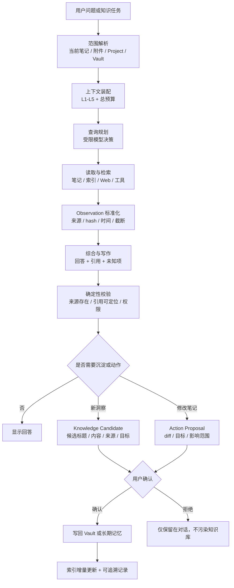
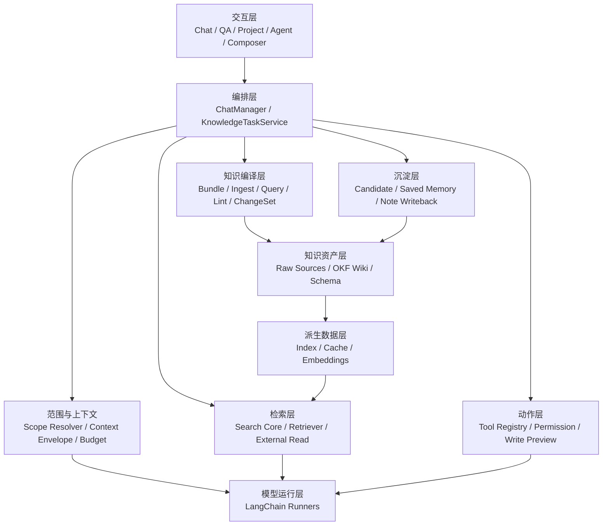

# Personal Knowledge Agent Solution / 个人知识库智能体方案

Status: Draft review baseline

Last updated: 2026-07-16

Primary audience: product review, architecture review, engineering planning

本文描述如何以 Copilot for Obsidian 为底座，构建一个本地优先、证据可追溯、可持续积累的个人知识库智能体。方案融合三类外部思想：DeerFlow SOC Agent 的受控 Runtime、Karpathy LLM Wiki 的复利式知识维护，以及 Google Open Knowledge Format（OKF）的可移植知识格式。

本文不是 Copilot 全项目架构说明，也不是功能流水账。现有消息与上下文实现分别以 [`MESSAGE_ARCHITECTURE.md`](./MESSAGE_ARCHITECTURE.md) 和 [`CONTEXT_ENGINEERING.md`](./CONTEXT_ENGINEERING.md) 为准。

---

## 0. 结论

要构建的不是“能搜索 Obsidian 的聊天框”，也不是“可以任意改动整个 Vault 的全自动 Agent”，而是一个可信的个人知识工作系统：

- 用户选定的 Raw Sources 始终是不可被 Agent 静默改写的知识源。
- LLM 维护一个与 Raw Sources 分离、由 Markdown 页面和链接组成的持久 Wiki。
- Wiki 可以按 OKF v0.1 输出为可被其他 Agent 消费的标准知识 Bundle。
- 确定性代码负责范围、上下文、预算、权限、持久化和审计。
- 模型在有边界的节点内负责查询规划、关联、归纳、写作和建议。
- 搜索结果、历史对话和模型总结都不自动成为事实。
- 新洞察先成为候选内容，用户确认后才写回 Vault 或长期记忆。
- 所有写入默认可预览、可拒绝、可定位来源；索引和缓存可随时重建。
- Chat、Vault QA、Project、Agent、Composer 等入口复用同一组知识与动作契约。

第一阶段的价值不是“更多自治”，而是让用户能稳定地完成一个闭环：加入来源，形成相互连接的 Wiki，提出问题，获得带来源的答案，把值得保留的结果确认写回，并能在以后准确找回。

---

## 1. 用户与问题

### 1.1 目标用户

主要用户是长期使用 Obsidian 管理研究、项目、决策、阅读和创作材料的个人用户。用户通常已经拥有大量笔记，但面临以下问题：

- 知识分散在笔记、附件、网页、视频、聊天和项目目录中。
- 搜索能找到文本，却难以恢复当时的上下文、结论和依据。
- 模型可以生成漂亮答案，但用户难以判断它引用了什么、遗漏了什么。
- 聊天中产生的新洞察容易消失，自动写入又可能污染知识库。
- Agent 可以执行工具，但读、建议、写入和外部副作用的边界不够统一。
- 大项目和长对话会造成上下文重复、过期或超出模型窗口。

### 1.2 核心 Job-to-be-Done

当我研究、回顾、规划或创作时，我希望助手能在我授权的知识范围内找到相关材料，说明答案依据，把新信息与已有知识联系起来，并帮助我把确认过的结论沉淀回 Obsidian，以便未来继续使用，而不破坏原始资料或制造不可追溯的“AI 知识”。

### 1.3 产品原则

1. 用户资产优先：Markdown、附件和用户可见配置是可迁移资产。
2. 来源优先：引用原始材料，不把模型总结伪装成原文事实。
3. 范围优先：当前笔记、显式附件、Project 和全 Vault 是不同授权范围。
4. 候选优先：自动推导的知识先等待确认，再进入长期知识层。
5. 可恢复优先：索引、缓存、摘要和运行态上下文都必须可重建。
6. 渐进自治：先可靠读取和建议，再安全写入，最后才考虑复杂自治。

---

## 2. 技术思想如何组合

### 2.1 四层定位

| 来源 | 解决的问题 | 在本项目中的位置 |
| --- | --- | --- |
| Obsidian Copilot | 对话、上下文、搜索、模型、工具和 Vault 集成 | 产品与工程底座 |
| Karpathy LLM Wiki | 如何让知识随来源和问题持续积累，而不是每次从 raw chunks 重新推导 | 知识维护工作流 |
| Google OKF v0.1 | 如何让不同生产者和 Agent 交换 Markdown 知识库 | Wiki 文件与互操作契约 |
| SOC Agent 技术方法 | 如何约束模型、来源、权限、记忆和副作用 | Runtime 与治理边界 |

这四者不能互相替代：OKF 是格式而不是搜索引擎，LLM Wiki 是工作模式而不是权限系统，SOC 方法是控制边界而不是个人知识模型，Copilot 则负责把它们变成实际产品。

### 2.2 从 SOC 方案迁移什么

| SOC 技术思想 | 在个人知识库中的改写 | 采用结论 |
| --- | --- | --- |
| 确定性 Runtime 掌握主流程 | 应用代码掌握上下文装配、预算、工具执行、权限和持久化 | 保留 |
| LLM 只在受控节点推理 | 模型负责查询规划、归纳和写作，不绕过范围与写入规则 | 保留 |
| Evidence Layer 与字段可信度 | 知识来源、内容快照、检索命中、模型推导分层展示 | 保留并简化 |
| Tool 结果只作为证据 | 搜索和外部工具结果作为 Observation，不直接改写知识 | 保留 |
| 候选记忆经人工确认 | 洞察、偏好和总结先成为 Knowledge Candidate，再由用户保存 | 保留 |
| 高风险动作审批 | 文件写入显示 diff；外部或批量副作用显式授权 | 保留并适配个人场景 |
| 薄入口复用核心服务 | Chat、Project、Agent、Composer 使用共享契约 | 保留 |
| Typed governed facts | 用类型化 `KnowledgeArtifact`、范围、来源和新鲜度代替通用事实库 | 只保留类型治理思想 |
| Replay、trace、eval | 保存输入范围、来源 hash、工具记录和输出版本，用任务集回归 | 保留 |
| 多领域子 Agent | 等单 Agent 工作流和上下文封装稳定后再评估 | 延后 |
| 告警、租户、Kafka、复核队列、PostgreSQL | 与本地个人知识库的主要问题无关 | 舍弃 |
| 检测真值、运营处置、置信度校准 | 不适用于通用知识问答；改用引用覆盖与任务正确性 | 舍弃领域语义 |

最重要的迁移不是复制类名，而是把“模型输出”从系统事实中分离出来：原始笔记、检索结果、模型推导和用户确认后的知识，必须处于不同层级。

### 2.3 从 Karpathy LLM Wiki 迁移什么

Karpathy 模式的关键不是“让 Agent 写 Markdown”，而是把一次性 RAG 变成持续编译的知识层：

- Raw Sources：用户选择的文章、论文、记录、图片和数据。默认不可变，只作为来源读取。
- Wiki：LLM 维护的摘要、实体、概念、比较和综合页面。新来源会更新已有页面，而不只新增一个孤立摘要。
- Schema：定义目录、页面类型、链接、引用和 Ingest / Query / Lint 工作流的规则文件。
- `index.md`：面向内容的分层目录，支持人和 Agent 渐进发现页面。
- `log.md`：按时间追加的操作历史，用于理解最近摄入、查询和维护动作。
- Ingest：读取一个新来源，生成来源摘要，并更新受影响的概念和索引。
- Query：优先查询已编译 Wiki，必要时回到 Raw Sources；有价值的答案可成为新 Wiki 页面。
- Lint：周期性检查矛盾、陈旧主张、孤立页面、断链、缺少引用和知识缺口。

本项目不直接采用“LLM 完全拥有 Wiki、所有写入无需确认”的强假设。默认使用可预览的多文件变更；用户可以只对指定 generated wiki 目录开启有限自动维护，Raw Sources 永远不在该授权内。

### 2.4 从 OKF v0.1 迁移什么

OKF 将 LLM Wiki 收敛为非常小的互操作表面：

- 一个 Bundle 是包含 Markdown 文件的目录树。
- 每个普通 concept 文件必须有可解析 YAML frontmatter，唯一必填字段是非空 `type`。
- 推荐字段为 `title`、`description`、`resource`、`tags` 和 `timestamp`。
- `index.md` 和 `log.md` 是保留文件名，分别表示目录索引和变更历史。
- Bundle 根 `index.md` 可以用唯一允许的 frontmatter 声明 `okf_version: "0.1"`。
- concept 通过标准 Markdown 链接形成关系图；关系语义由链接周围的正文表达。
- `# Citations` 是外部来源引用的约定章节。
- Consumer 必须宽容未知 `type`、扩展字段、断链和缺失的可选索引。
- OKF 不规定 taxonomy、数据库、检索基础设施、Agent 框架或领域 schema。

采用策略是“内部宽容、导出标准”：Copilot 可以读取普通 Obsidian Vault、wikilink 和现有 frontmatter；只有用户指定的知识 Bundle 才要求或逐步迁移到 OKF。标准 Markdown link 作为 Bundle 内首选链接格式，Obsidian wikilink 作为本地兼容扩展处理。

---

## 3. 产品形态

不同入口服务不同工作，但不应各自实现一套知识逻辑。

| 入口 | 主要用途 | 约束 |
| --- | --- | --- |
| Chat | 围绕显式上下文讨论、总结和创作 | 默认只使用当前轮附件与允许的记忆 |
| Vault QA | 跨 Vault 检索和综合回答 | 返回可定位的来源，说明检索不足 |
| Project | 在项目文件、标签和项目说明范围内持续工作 | 项目范围与聊天历史隔离 |
| Agent Mode | 多步搜索、读取、整理和动作建议 | 工具受注册表、预算和权限控制 |
| Composer / Quick Command | 对选中文本或目标笔记进行变换 | 写入前提供预览，保持目标明确 |
| ACP Agent（规划） | 接入 Codex、Claude Code、OpenCode 等外部 Agent | 作为平行 Runtime，不假装复用 LangChain 上下文与工具栈 |

所有入口最终共享四类能力：知识范围解析、知识检索、知识综合和受控写入。

---

## 4. 核心知识闭环



这个闭环必须在工具不可用或检索无结果时仍能返回明确状态，例如“仅依据当前笔记回答”“未找到足够证据”或“外部来源不可用”，而不是用流畅文本掩盖缺失。

### 4.1 三层知识目录

建议把 Source、Wiki 和 Schema 物理分开，避免 OKF consumer 把任意原始 Markdown 误认为 concept：

```text
personal-knowledge/
├── sources/                  # 用户维护或导入；Agent 默认只读
│   ├── articles/
│   ├── papers/
│   └── assets/
├── wiki/                     # OKF Bundle；Agent 可在权限内维护
│   ├── index.md
│   ├── log.md
│   ├── concepts/
│   │   └── ...
│   ├── entities/
│   │   └── ...
│   └── syntheses/
│       └── ...
└── schema/                   # Copilot 的 Wiki 维护规则，不属于 OKF Bundle
    └── knowledge-schema.md
```

目录名只是示例，不应硬编码。用户可为一个 Project 指定 `sourceRoots`、`wikiRoot` 和 `schemaRef`。`wikiRoot` 是 OKF Bundle 根；Source 和 Schema 可以位于任意 Vault 路径。

一个最小 Wiki concept 可以是：

```markdown
---
type: Concept
title: Context Engineering
description: 如何为模型选择、组织和控制任务上下文。
tags: [ai, context]
timestamp: 2026-07-16T00:00:00Z
status: reviewed
source_refs:
  - ../sources/articles/context-engineering.md
---

# Summary

...

# Relationships

See [Retrieval-Augmented Generation](../concepts/rag.md).

# Citations

[1] [Source note](../../sources/articles/context-engineering.md)
```

`status` 和 `source_refs` 是本项目扩展字段。OKF consumer 应保留但无需理解它们；`type` 保持简短、自解释，并允许用户在 Schema 中定义自己的 taxonomy。

### 4.2 Ingest、Query、Lint 三类工作流

Ingest 不是“为文件生成 embedding”这么简单，而是一次受控的知识编译：

1. 计算来源 identity、hash 和时间，判断新增、更新或重复。
2. 提取摘要、实体、概念、主张、时间线、矛盾和待确认项。
3. 读取 `index.md` 和相关 Wiki 页面，而不是扫描全部页面。
4. 生成一个多文件 ChangeSet：新增来源摘要、更新概念、补链接、更新 index、追加 log。
5. 校验引用、链接、OKF frontmatter 和写入范围。
6. 默认展示 ChangeSet；用户接受后原子写入，失败时回滚。

Query 先利用已经编译的 Wiki，再按需下钻 Raw Sources 和检索索引。答案若包含可复用的新比较、综合或决策，可生成 `KnowledgeCandidate`，而不是只留在聊天历史。

Lint 是显式或计划触发的维护任务，至少检查：

- YAML 与 OKF 合规性；
- `index.md` 是否遗漏页面或描述过期；
- 断链、孤立页面和缺少反向关系的关键页面；
- 无来源的主张、失效引用和 Source hash 变化；
- 新来源与旧综合之间的矛盾；
- 同义页面、重复概念和可合并条目；
- 长期未更新但仍被频繁引用的陈旧页面；
- 尚无页面的重要概念和需要继续研究的问题。

Lint 只产生报告或 ChangeSet，不静默重写整个 Wiki。

---

## 5. 架构基线与目标结构

### 5.1 当前可复用基线

| 当前模块 | 在方案中的角色 |
| --- | --- |
| `MessageRepository` | 每个项目消息的单一事实源，保存显示文本、处理文本和上下文信封 |
| `ChatManager` | 聊天业务协调器，负责消息、上下文、模型调用和持久化 |
| `ContextManager` | 处理笔记、URL、选中文本、标签和目录，并构建当前轮上下文 |
| `PromptContextEnvelope` | L1-L5 的版本化、可 hash、模型无关上下文契约 |
| `ProjectManager` | 项目范围、项目上下文缓存和模式切换 |
| Search v3 / Vector Store | 词法、语义、过滤、合并与索引能力；属于派生检索层 |
| `ToolRegistry` | 工具发现、启用、元数据和 LangChain 原生工具绑定 |
| Composer tools | 带预览和用户设置约束的笔记写入能力 |
| `UserMemoryManager` | Recent Conversations 与用户显式 Saved Memories |
| `ChatPersistenceManager` | 项目感知的聊天 Markdown 保存与加载 |

当前仓库还没有完整的 OKF Bundle 管理器、Ingest ChangeSet 或 Wiki Linter；它们属于本方案新增能力，不能在实现评审中被当作已完成模块。

### 5.2 目标分层



近期不必立即创建一个庞大的 `KnowledgeTaskService`。它代表应逐步抽出的共享业务边界，避免把新逻辑继续堆入 UI 或单个 Chain Runner。OKF 解析与校验应保持为无模型依赖的 leaf module；Ingest 编排再通过服务层调用模型、检索和写入工具。

---

## 6. 类型化知识与证据模型

### 6.1 `KnowledgeArtifact`

上下文处理的长期方向应从“先渲染 XML，再用正则解析 XML”演进为类型化 artifact。建议的概念契约：

```ts
interface KnowledgeArtifact {
  id: string;
  kind: "note" | "selection" | "attachment" | "web" | "video" | "search_hit" | "memory";
  sourceRef: string;
  scope: "turn" | "project" | "vault" | "external";
  content: string;
  contentHash: string;
  observedAt: number;
  recoverability: "refetchable" | "snapshot" | "non_recoverable";
  metadata: Record<string, unknown>;
}
```

该结构是架构方向，不要求在 MVP 一次替换现有 `PromptLayerSegment`。第一步可以扩展现有 segment metadata，让来源、hash、可恢复性和截断状态可被检查。

`KnowledgeArtifact` 是一次 Runtime 中实际使用的内容快照；它不等于持久化的 OKF concept。持久化层还需要三个小契约：

```ts
interface KnowledgeBundleConfig {
  id: string;
  sourceRoots: string[];
  wikiRoot: string;
  schemaRef: string;
  reviewMode: "always" | "multi_file" | "trusted_generated_only";
}

interface OkfConceptDocument {
  path: string;
  type: string;
  title?: string;
  description?: string;
  resource?: string;
  tags?: string[];
  timestamp?: string;
  extensions: Record<string, unknown>;
  body: string;
}

interface KnowledgeChangeSet {
  id: string;
  operation: "ingest" | "query_writeback" | "lint_fix";
  sourceRefs: string[];
  changes: Array<{ path: string; beforeHash?: string; afterContent: string }>;
  validation: { okfValid: boolean; citationsValid: boolean; linksValid: boolean };
  status: "proposed" | "accepted" | "rejected" | "applied" | "failed";
}
```

路径覆盖、越界写入、同文件并发修改和部分失败必须在应用 ChangeSet 前由确定性代码处理。模型只能提出 ChangeSet，不能自己宣称事务成功。

### 6.2 知识层级

| 层级 | 含义 | 能否直接视为事实 |
| --- | --- | --- |
| Source | Vault 原文、用户选区、已获取的网页快照 | 可以引用，但仍需考虑时效和来源质量 |
| Derived | 解析文本、chunk、索引、embedding、摘要 | 不可替代 Source，可重建 |
| Observation | 一次检索或工具调用返回的结果 | 只能证明工具当时返回了什么 |
| Synthesis | 模型的回答、关联、解释或草稿 | 不是知识库事实 |
| Candidate | 建议保存的新洞察、摘要、偏好或决策 | 等待用户确认 |
| Confirmed | 用户确认写入的笔记或 Saved Memory | 成为可复用知识，但保留来源与更新时间 |

### 6.3 引用与 grounding

回答中的重要事实应尽可能绑定到当前模型实际看到的 artifact，而不是绑定到模型未读取的整篇文件。

最低要求：

- 引用能定位到笔记路径或外部 URL。
- 引用来源存在于本次上下文或工具结果中。
- 被截断、摘要或解析失败的来源带明确标记。
- 没有来源支持的推导以“推断”或“建议”表达。
- 搜索得分只表示相关性，不表示真实性或结论置信度。

---

## 7. 上下文工程

现有 L1-L5 `PromptContextEnvelope` 继续作为 LangChain 路径的规范上下文：

| Layer | 个人知识库语义 |
| --- | --- |
| L1 System | 稳定系统规则、用户显式记忆、项目说明 |
| L2 Previous | 之前轮次使用过的紧凑知识引用库 |
| L3 Turn | 当前轮显式附加的笔记、选区、网页和附件 |
| L4 Strip | 经过压缩的近期对话，不重复存放 artifact 全文 |
| L5 User | 当前用户任务 |

必须优先解决的不是继续增加上下文来源，而是建立全请求预算：

```text
总输入预算
- L1 稳定规则与项目上下文
- L2 历史 artifact 引用
- L3 当前轮 artifact
- L5 当前问题
- 输出预留
= L4 可用预算
```

上下文策略：

1. 预算在最终装配点统一执行，而不是每层各自判断。
2. 当前轮显式附件优先于自动检索和旧对话。
3. 不可恢复的选中文本优先保留原文；可重新读取的笔记可以保留引用和摘要。
4. Project 内容不能无限拼入 L1，应按任务检索或预算化装配。
5. 聊天加载后应重建必要 envelope，保证恢复前后行为一致。
6. fallback segment ID 必须由内容 hash 生成，不能使用时间戳。
7. ACP 路径只传当前轮显式上下文，由 ACP Agent 自己管理会话，不重复注入 LangChain 的 L2/L4。

---

## 8. 搜索与检索

检索层的目标不是“返回更多 chunk”，而是以最小证据集合支持当前任务。

建议流程：

1. Scope Resolver 确定当前笔记、Knowledge Bundle、Project、标签/目录或全 Vault 范围。
2. 对 Knowledge Bundle 先读取相关层级的 `index.md`，以低成本完成渐进发现。
3. Query Planner 生成有限数量的检索意图和关键词，不直接生成答案。
4. Search Core 按规模并行使用目录索引、词法、语义、链接图和结构信号。
5. Result Merger 去重，并保留每条命中的来源与各路得分。
6. Context Selector 在 token 预算内选择覆盖面与相关性更好的片段。
7. 模型基于实际选中的 Wiki 页面回答，必要时回读 Raw Sources。
8. Citation Validator 检查答案引用能否回到选中片段和 Source。

索引是派生缓存，不是知识源：切换 embedding provider、索引损坏或算法升级时，应能从 Vault 重建，不影响原始知识。

需要监控的检索退化包括：解析失败、文件过期、索引版本不匹配、只返回同一文件的重复 chunk、语义与词法结果严重冲突、预算导致高价值片段被截断。

---

## 9. Skill、工具、记忆和笔记如何分工

| 内容 | 应放在哪里 | 示例 |
| --- | --- | --- |
| 可复用工作方法 | Skill 或 Custom Command | 文献综述方法、周回顾模板、会议纪要整理流程 |
| Wiki 结构与维护约定 | Bundle Schema | 页面类型、命名、Ingest、Query、Lint 和 review 策略 |
| 对系统的查询或动作 | Tool / MCP / ACP tool | 搜索 Vault、读取网页、创建或修改笔记 |
| 用户稳定偏好 | Saved Memories | 偏好的输出语言、写作风格、长期目标 |
| 短期会话线索 | Recent Conversations / L4 | 最近讨论过的主题和结论摘要 |
| 项目事实和材料 | Vault note / Project files | 项目目标、决策记录、研究资料 |
| 模型发现但未确认的洞察 | Knowledge Candidate | 跨笔记主题、建议的新链接、待保存总结 |
| 检索派生数据 | Index / cache | chunk、embedding、相关性分数 |
| 可交换的编译知识 | OKF Wiki Bundle | concept、index、log、标准链接和引用 |
| 稳定行为边界 | 代码和类型契约 | 权限、预算、状态转换、schema 校验 |

不得把整个知识库规则都堆进系统 prompt。行为方法进入 Skill，外部能力进入 Tool，事实进入 Vault，偏好进入 Memory，运行约束进入代码。

---

## 10. 知识沉淀与记忆

现有两类 memory 继续保留，但语义必须清楚：

- Recent Conversations 是自动生成的有限历史摘要，可能不完整，不应作为权威事实。
- Saved Memories 由用户显式要求保存，适合偏好和稳定个人信息，不应替代项目笔记。

新增的 `KnowledgeCandidate` 主要解决“聊天洞察如何安全回到 Vault”：

```ts
interface KnowledgeCandidate {
  id: string;
  kind: "new_note" | "append" | "link" | "summary" | "decision" | "saved_memory";
  title?: string;
  content: string;
  sourceRefs: string[];
  targetRef?: string;
  reason: string;
  createdAt: number;
  status: "proposed" | "accepted" | "rejected";
}
```

MVP 不需要建立类似 SOC 的后台复核队列。候选内容直接在当前对话中以卡片或 diff 显示：

1. 模型提出保存建议。
2. 系统显示内容、来源和目标位置。
3. 用户可编辑、接受或拒绝。
4. 接受后通过统一写入工具落盘。
5. 索引监听文件变化并增量更新。

自动生成的候选不能在后台静默进入 Saved Memories，也不能因为多次检索到相似内容就自动升级为事实。

---

## 11. 工具、动作与权限

### 11.1 动作等级

| Level | 动作 | 默认策略 |
| --- | --- | --- |
| L0 | 读取当前轮显式上下文 | 允许 |
| L1 | 在用户选择的 Vault/Project 范围内搜索和读取 | 允许，并记录来源 |
| L2 | 生成建议、草稿、链接或修改方案 | 允许，明确标记为建议 |
| L3 | 创建、覆盖、追加或重命名 Vault 内容 | 默认展示 preview/diff，用户可配置有限自动接受 |
| L4 | 批量修改、删除、执行外部写操作 | 每次显式确认，记录目标与结果 |
| L5 | 运行任意系统命令或不可逆外部副作用 | 仅 ACP/受控 adapter，在明确范围和权限下开放 |

### 11.2 统一执行记录

工具结果应标准化为 `ToolExecutionRecord`，至少包含：

- tool id 与 schema version；
- 输入摘要和目标范围；
- started/finished 时间；
- success/denied/failed/timeout 状态；
- 结果来源或受影响文件；
- 是否经过用户确认；
- 安全错误信息，不记录密钥。

读取工具的结果进入 Observation；写入工具的结果进入持久化记录。模型不能只通过输出一段 XML 或声称“已写入”来绕过实际工具边界。

---

## 12. Runtime 与 Agent 策略

### 12.1 LangChain Runtime（当前主路径）

继续使用现有 Chain Runner：基础聊天、Vault QA、Copilot Plus 和 Autonomous Agent 都从 `PromptContextEnvelope` 装配消息。新增规则优先放在共享上下文、工具执行和结果处理层，避免为每个 Runner 复制逻辑。

Autonomous Agent 仍采用顺序 ReAct 循环。显式 Planner 可以作为后续 sidecar 状态加入，但第一阶段不依赖 Planner 才能完成知识闭环。

### 12.2 ACP Runtime（平行演进路径）

ACP Agent 管理自己的会话、工具和上下文窗口，因此应保持独立：

- 复用聊天 UI、消息展示和当前轮附件选择。
- 不复用 LangChain 的 Chain Runner、L2/L4、MemoryManager 或 ToolRegistry 执行路径。
- 通过独立 port/adapter 处理 session、permission、terminal 和 tool update。
- Vault 写入必须映射到相同的权限语义，即使底层协议不同。

### 12.3 子 Agent

MVP 不引入研究、写作、整理等多个子 Agent。只有在以下条件满足后才评估：

- 单 Agent 的任务状态与失败类型可观察；
- `ContextCapsule` 能用目标、关键发现、artifact 引用和下一步传递结果；
- 全请求 token 预算已稳定；
- 工具权限和写入审计已统一；
- 基准任务证明并行 Agent 的收益高于复杂度和成本。

---

## 13. 持久化与数据所有权

| 数据 | 位置 | 角色 |
| --- | --- | --- |
| Raw Sources | 用户指定的 Vault Markdown、网页快照与附件 | 不可被 Agent 静默修改的来源资产 |
| Compiled Wiki | OKF-compatible Markdown Bundle | LLM 维护、人可阅读的复利知识层 |
| Bundle Schema | 用户指定的 schema 文件 | 页面结构和维护工作流 |
| `index.md` / `log.md` | Wiki Bundle 保留文件 | 渐进发现和变更时间线 |
| Proposed ChangeSet | 消息元数据或临时运行数据 | 多文件变更预览、校验和确认状态 |
| 项目定义 | Vault 中的 Project 配置/文件 | 范围和稳定项目上下文 |
| 聊天历史 | Markdown chat 文件 | 用户可读的会话记录 |
| Saved Memories | 用户配置的 memory 文件夹 | 用户确认的长期偏好与事实 |
| Recent Conversations | memory 文件夹中的滚动摘要 | 非权威的回忆辅助 |
| Context Envelope | 运行态/消息元数据，未来可持久化紧凑快照 | 重现当轮模型上下文 |
| 索引与 embedding | 插件数据或后端缓存 | 可重建的派生数据 |
| 工具执行记录 | 消息元数据或轻量事件记录 | 调试、权限与回放 |

持久化原则：

- 原始笔记永远不因索引、模型或 provider 变化而失效。
- Raw Source 与 Compiled Wiki 在路径和写权限上分离。
- OKF 合规是 Wiki Bundle 的可移植能力，不强制整个 Vault 改造。
- 保存聊天后重新加载，关键上下文语义应能确定性恢复。
- Project 切换必须同时隔离消息历史、上下文范围和后续候选写入目标。
- 候选内容在接受前不进入索引和长期 memory。
- 用户能通过普通文件操作查看、编辑、迁移或删除长期知识。

---

## 14. 安全、隐私与失败模式

安全不只指恶意攻击，也包括误写、范围泄漏和错误沉淀。

主要风险与约束：

| 风险 | 约束 |
| --- | --- |
| Prompt injection 指挥 Agent 忽略规则 | 外部内容作为 artifact/Observation，不成为系统指令 |
| Project A 内容泄漏到 Project B | Scope Resolver 和 MessageRepository 均使用项目身份隔离 |
| 模型虚构来源 | 引用必须对应实际输入 artifact 或工具结果 |
| 自动总结污染长期记忆 | 自动总结只进入 Recent Conversations 或 Candidate |
| LLM 更新多个 Wiki 页面后产生不一致 | 使用 ChangeSet、before hash、合规校验、原子应用和回滚 |
| Wiki 综合掩盖 Raw Source 的矛盾 | concept 保留引用和冲突说明，Query 可下钻原文 |
| OKF 扩展变成新的私有锁定 | 核心字段遵守 v0.1，扩展字段可忽略并在 round-trip 时保留 |
| 大上下文导致遗漏或请求失败 | 最终装配点执行总预算和优先级降级 |
| 写错文件或覆盖原文 | 目标规范化、diff preview、用户确认和原子写入 |
| 外部 provider 接收敏感笔记 | 在发送前让范围可见，并支持本地/自托管 provider |
| Popout window 中 UI 或确认框落到错误窗口 | 从元素 `.doc` / `.win` 派生文档与窗口，迁移时重建 renderer |
| 工具超时或部分失败 | 返回类型化失败，不能把失败结果当作有效知识 |

密钥、完整请求头和未脱敏调试 payload 不得写入文档、聊天或执行记录。

---

## 15. 评测与可观测性

不要使用模型自报 confidence 作为“答案正确率”。个人知识系统更适合测量以下指标：

### 15.1 核心指标

- Grounded answer rate：关键结论能够回到实际上下文来源的比例。
- Knowledge reuse rate：用户确认保存的知识在后续任务中被有效找回的比例。
- Successful writeback rate：候选内容经用户确认后正确写入目标位置的比例。
- Compounding coverage：新增来源被整合到已有相关概念而非只生成孤立摘要的比例。

### 15.2 质量与护栏指标

- 检索覆盖：已知相关笔记是否进入候选结果。
- 引用精度：引用是否真正支持对应结论。
- Scope leakage：是否读取或引用超出当前 Project/用户选择范围的内容。
- Candidate acceptance / correction / rejection rate：候选是否有用、需要多少编辑。
- Memory correction rate：Saved Memory 被用户纠正或删除的频率。
- Token budget compliance：是否有超预算请求到达 provider。
- Persistence parity：保存、重载后相同任务的上下文行为是否一致。
- Tool safety：未经授权写入、错误目标、部分失败和超时率。
- Wiki health：OKF 不合规、断链、孤立页面、无引用主张和过期页面数量。
- 延迟与成本：上下文装配、检索、模型调用和写入各阶段耗时。

### 15.3 基准任务集

用脱敏或合成 Vault fixture 建立可回放任务：

1. 单笔记事实问答。
2. 多笔记对比与矛盾识别。
3. 按时间范围回顾工作。
4. 从 Project 材料生成带引用总结。
5. 从对话生成候选决策记录并写回指定笔记。
6. 大上下文下的预算降级。
7. 保存聊天、重载并继续追问。
8. 恶意网页文本试图触发写入。
9. 搜索或 provider 不可用时的降级回答。
10. Project 切换后的范围隔离。
11. 摄入一个新来源并更新多个已有 concept、index 与 log。
12. 同一来源重复摄入或内容 hash 变化时的幂等与更新行为。
13. Lint 检测断链、孤立页面、矛盾和缺少引用。
14. OKF Bundle 被另一个宽容 consumer 读取并保留未知扩展字段。

每次运行应记录模型、上下文版本、检索配置、artifact hash、工具记录和结果，避免仅凭截图评估。

---

## 16. MVP 与路线图

### Phase 1：可信问答基础

- 实现无模型依赖的 OKF v0.1 parser、validator 和 Bundle 配置 spike。
- 支持从用户指定 `wikiRoot` 读取分层 `index.md`、concept 和 `log.md`。
- 在最终消息装配点执行 L1-L5 总 token 预算。
- 修复聊天重载后的 envelope 恢复一致性。
- 使用确定性 fallback artifact ID。
- 统一笔记、搜索和外部来源的引用元数据。
- 增加多轮、Project 隔离、预算和引用回归测试。

完成标准：用户能在当前笔记、Project、Vault 和一个只读 OKF Bundle 中稳定获得可定位来源的答案，且不会发送超预算请求。

### Phase 2：知识沉淀闭环

- 实现单来源 Ingest：来源登记、相关页面发现、concept/index/log ChangeSet。
- 引入轻量 `KnowledgeCandidate` 展示模型。
- 支持从回答创建新笔记、追加、链接、决策记录或 Saved Memory。
- 所有写入复用 preview/diff、before hash、OKF/citation/link 校验与用户确认。
- 候选写入保留来源引用，写入后增量更新索引。
- 记录接受、编辑、拒绝结果用于离线评测，不自动训练或改写 prompt。

完成标准：用户能把一个新来源或一次有依据的回答，通过一个可审查的多文件 ChangeSet 沉淀为相互连接、符合 OKF 的知识。

### Phase 3：类型化 Artifact 与统一动作边界

- Context Processor 直接产生类型化 artifact，XML 只作为渲染格式。
- 实现 Wiki Lint 和来源 hash 漂移检测。
- 为 OKF Bundle 增加导入、导出和宽容 round-trip 测试。
- 从 index、链接和 frontmatter 派生交互式知识图，用于浏览 topic、entity、claim、source、孤立节点和隐含关系；图是消费视图，不是新的事实源。
- 引入统一 `ToolExecutionRecord` 和动作等级。
- 将搜索、读取、Composer 与未来 MCP 的结果统一为 Observation/Action Result。
- 加入最小 Planner sidecar 和任务状态可视化，但不暴露隐藏思维链。

完成标准：不同入口对同一来源、工具和写入动作具有一致语义与测试方式。

### Phase 4：ACP 与可扩展工作流

- 实现独立 ACP port/adapter、session、permission 和 terminal 生命周期。
- 支持用户配置的 Markdown Skills，按需披露而非全部注入。
- 在真实任务集上比较 LangChain Agent 与 ACP Agent。
- 只在单 Agent 基准证明不足后试验 Context Capsule 和子 Agent。

完成标准：外部 Agent 能在不破坏 Copilot 数据所有权和权限边界的前提下完成复杂知识任务。

---

## 17. 非目标

当前方案明确不做：

- 自动重写、移动或“清理”整个 Vault。
- 把向量数据库、embedding 或模型总结当作知识源。
- 未经确认自动把聊天结论写入长期记忆。
- 为个人知识库引入 Kafka、PostgreSQL、租户系统或后台复核队列。
- 强制把现有整个 Vault 一次性迁移为 OKF，或拒绝读取非 OKF 笔记。
- 把 OKF 当作检索算法、向量数据库、权限系统或 Agent Runtime。
- 一开始就建设多 Agent 编排、知识图谱本体或通用工作流引擎。
- 用一个通用自然语言匹配器决定所有知识范围、权限和写入目标。
- 为了适配某类笔记而硬编码目录名、语言词表或内容模式。
- 在本方案阶段修改任何 AI prompt 内容。

---

## 18. 当前架构决策

| 决策 | 理由 |
| --- | --- |
| Vault Markdown 是知识事实源 | 用户可读、可编辑、可迁移，不依赖模型或服务商 |
| Raw Sources 与 LLM-maintained Wiki 分层 | 既保留来源真实性，又获得持续综合和链接的复利价值 |
| 指定 Wiki Root 采用 OKF v0.1 | 提供最小、开放、可被其他 Agent 消费的文件契约 |
| 普通 Vault 读取保持宽容 | 不用标准化成本阻断现有 Obsidian 工作流 |
| `index.md` 优先于全量扫描 | 支持 Agent 渐进发现并降低 token 与检索成本 |
| 多文件 Wiki 更新使用 ChangeSet | 让跨页面维护可预览、校验、原子应用和回滚 |
| `PromptContextEnvelope` 是 LangChain 上下文契约 | 已覆盖所有当前 Chain Runner，并提供层级和 hash |
| Search index 是派生缓存 | 可重建，不能覆盖原始内容 |
| 用户显式附件高于自动检索 | 尊重当前任务意图并降低上下文噪声 |
| 模型输出先是 Synthesis 或 Candidate | 防止流畅回答直接污染长期知识 |
| 写入默认 preview/diff | 个人知识库最常见的高风险是误写而非网络攻击 |
| LangChain 与 ACP 使用平行 Runtime | 两者的上下文、工具和会话所有权不同 |
| 暂不引入子 Agent | 当前更需要预算、引用、权限和持久化正确性 |
| 先补可靠性，再增加自治 | 可靠知识闭环比复杂 Agent 演示更有持续价值 |

---

## 19. 评审清单

### 产品评审

- 用户能否知道答案用了哪些知识、遗漏了哪些知识？
- 聊天产生的价值能否低摩擦地沉淀回 Vault？
- 自动行为是否尊重当前笔记、Project 和 Vault 范围？
- 工具不可用时是否提供诚实且可用的降级结果？

### 上下文与检索评审

- 所有 artifact 是否具有稳定身份、来源、hash 和可恢复性？
- 总 token 预算是否在最终 payload 装配点执行？
- 检索相关性是否与事实可信度分离？
- 保存并重载聊天后是否保持关键上下文语义？
- Query 是否先通过 `index.md` 渐进发现，再按需读取 concept 和 Raw Source？

### Bundle 与 Wiki 评审

- `wikiRoot` 是否与只读 Source Roots 和 Schema 明确分离？
- 普通 concept 是否包含非空 `type`，保留文件是否符合 OKF 结构？
- 未知 type、扩展字段、断链或缺失 index 是否被宽容消费？
- Ingest 是否更新受影响的已有页面，而不只新增孤立摘要？
- ChangeSet 是否包含 source refs、before hash、index/log 更新和校验结果？
- Lint 是否只提出报告或变更集，而不静默重写整个 Wiki？

### 记忆与写回评审

- 该内容应该进入 Vault note、Saved Memory、Recent Conversations 还是 Candidate？
- 自动生成内容是否在用户确认前保持候选状态？
- 写回是否显示目标、diff 和来源？
- 用户能否编辑、拒绝、删除或纠正已沉淀内容？

### 工具与权限评审

- 这是读取、建议、单文件写入、批量写入还是外部副作用？
- 工具失败是否会被模型误认为成功？
- LangChain 与 ACP 是否遵守相同的用户权限语义？
- 调试信息是否避免记录密钥和敏感原文？

---

## 20. 相关文档

| 文档 | 用途 |
| --- | --- |
| [`MESSAGE_ARCHITECTURE.md`](./MESSAGE_ARCHITECTURE.md) | 当前 MessageRepository → ChatManager → UIState 架构 |
| [`CONTEXT_ENGINEERING.md`](./CONTEXT_ENGINEERING.md) | 当前 L1-L5 上下文实现、缺口和路线 |
| [`TOOLS.md`](./TOOLS.md) | 当前工具注册、提示集成和执行方式 |
| [`todo/TOKEN_BUDGET_ENFORCEMENT.md`](./todo/TOKEN_BUDGET_ENFORCEMENT.md) | 全 payload token 预算问题和修复方向 |
| [`todo/AGENT_PLANNING_REFLECTION_V0.md`](./todo/AGENT_PLANNING_REFLECTION_V0.md) | 最小 Planner 与可见任务状态设计 |
| [`todo/ACP_DESIGN.md`](./todo/ACP_DESIGN.md) | ACP 平行 Runtime 设计 |
| [`../src/memory/memory-design.md`](../src/memory/memory-design.md) | 当前 Recent Conversations 与 Saved Memories 语义 |
| [`GITHUB_PERSONAL_KNOWLEDGE_LANDSCAPE.md`](./GITHUB_PERSONAL_KNOWLEDGE_LANDSCAPE.md) | GitHub 活跃项目、技术路线、许可证与本项目采用建议 |
| [Karpathy LLM Wiki](https://gist.github.com/karpathy/442a6bf555914893e9891c11519de94f) | Raw / Wiki / Schema 与 Ingest / Query / Lint 原始模式 |
| [Google Cloud: Introducing the Open Knowledge Format](https://cloud.google.com/blog/products/data-analytics/how-the-open-knowledge-format-can-improve-data-sharing) | OKF 的官方定位、原则与发布说明 |
| [OKF v0.1 Specification](https://github.com/GoogleCloudPlatform/knowledge-catalog/blob/main/okf/SPEC.md) | Bundle、frontmatter、链接、index、log、citation 与合规规则 |

后续开发应以本文作为个人知识库方向的产品与架构入口，以具体类型、实现和测试作为工程事实。新的技术想法只有在能改善知识可追溯性、用户控制、恢复能力或任务成功率时，才应进入路线图。
