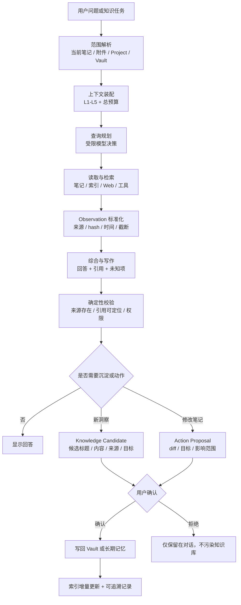
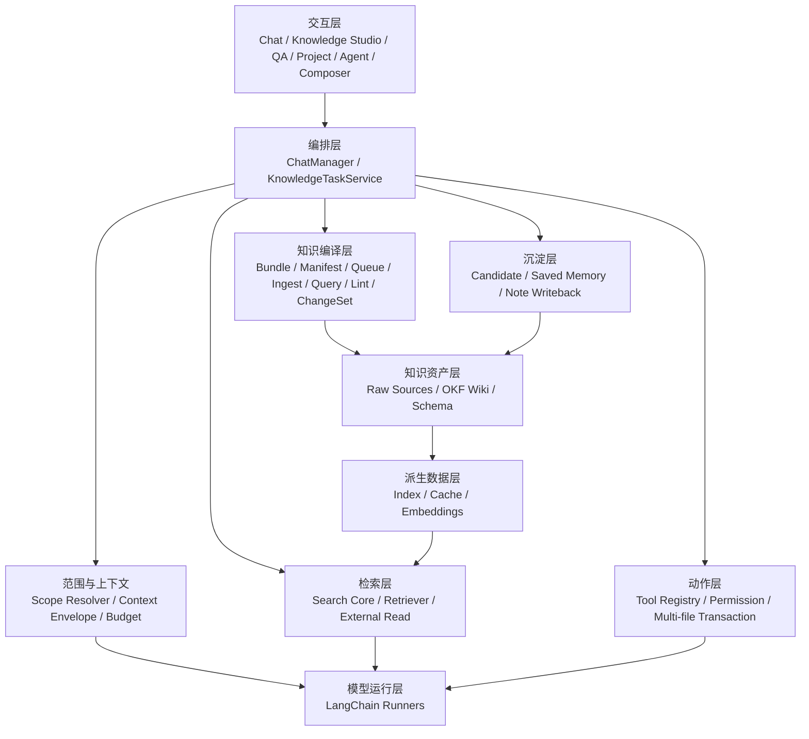

# Personal Knowledge Agent Solution / 个人知识库智能体方案

Status: Draft review baseline

Last updated: 2026-07-16

Primary audience: product review, architecture review, engineering planning

Primary platform: Obsidian Desktop on Windows

本文描述如何以 Copilot for Obsidian 为底座，构建一个本地优先、证据可追溯、可持续积累的个人知识库智能体。方案融合三类外部思想：DeerFlow SOC Agent 的受控 Runtime、Karpathy LLM Wiki 的复利式知识维护，以及 Google Open Knowledge Format（OKF）的可移植知识格式。

本文负责技术架构与治理边界。产品目标、用户体验和验收标准见 [`PERSONAL_KNOWLEDGE_OS_PRD.md`](./PERSONAL_KNOWLEDGE_OS_PRD.md)，外部项目的 commit、许可证和文件级采用方式见 [`OPEN_SOURCE_REUSE_PLAN.md`](./OPEN_SOURCE_REUSE_PLAN.md)。本文不是 Copilot 全项目架构说明，也不是功能流水账；现有消息与上下文实现分别以 [`MESSAGE_ARCHITECTURE.md`](./MESSAGE_ARCHITECTURE.md) 和 [`CONTEXT_ENGINEERING.md`](./CONTEXT_ENGINEERING.md) 为准。

---

## 0. 结论

要构建的不是“能搜索 Obsidian 的聊天框”，也不是“可以任意改动整个 Vault 的全自动 Agent”，而是一个可信的个人知识工作系统：

- Chat 保持为随时可用的助手入口，新增全页 Knowledge Studio 负责来源、Wiki、审核、活动、维护和图谱探索。
- 用户选定的 Raw Sources 始终是不可被 Agent 静默改写的知识源。
- LLM 维护一个与 Raw Sources 分离、由 Markdown 页面和链接组成的持久 Wiki。
- Wiki 可以按 OKF v0.1 输出为可被其他 Agent 消费的标准知识 Bundle。
- 确定性代码负责范围、上下文、预算、权限、持久化和审计。
- 模型在有边界的节点内负责查询规划、关联、归纳、写作和建议。
- 搜索结果、历史对话和模型总结都不自动成为事实。
- 新洞察先成为候选内容，用户确认后才写回 Vault 或长期记忆。
- 所有写入默认可预览、可拒绝、可定位来源；索引和缓存可随时重建。
- Chat、Vault QA、Project、Agent、Composer 等入口复用同一组知识与动作契约。

第一阶段的价值不是“更多自治”，而是把一个真实来源完整地变成以后可复用的知识：拖入来源，看到处理进度，审核多文件变更，形成相互连接的 Wiki，获得带来源的答案，把值得保留的结果确认写回，并在内容未变化时可靠跳过重复工作。

---

## 1. 用户与问题

### 1.1 目标用户

主要用户是长期使用 Obsidian 管理研究、项目、决策、阅读和创作材料的个人用户。用户通常已经拥有大量笔记，但面临以下问题：

- 知识分散在笔记、附件、网页、视频、聊天和项目目录中。
- 搜索能找到文本，却难以恢复当时的上下文、结论和依据。
- 模型可以生成漂亮答案，但用户难以判断它引用了什么、遗漏了什么。
- 聊天中产生的新洞察容易消失，自动写入又可能污染知识库。
- Agent 可以执行工具，但读、建议、写入和外部副作用的边界不够统一。
- 大项目和长对话会造成上下文重复、过期或超出模型窗口。

### 1.2 核心 Job-to-be-Done

当我研究、回顾、规划或创作时，我希望助手能在我授权的知识范围内找到相关材料，说明答案依据，把新信息与已有知识联系起来，并帮助我把确认过的结论沉淀回 Obsidian，以便未来继续使用，而不破坏原始资料或制造不可追溯的“AI 知识”。

### 1.3 产品原则

1. 用户资产优先：Markdown、附件和用户可见配置是可迁移资产。
2. 来源优先：引用原始材料，不把模型总结伪装成原文事实。
3. 范围优先：当前笔记、显式附件、Project 和全 Vault 是不同授权范围。
4. 候选优先：自动推导的知识先等待确认，再进入长期知识层。
5. 可恢复优先：索引、缓存、摘要和运行态上下文都必须可重建。
6. 渐进自治：先可靠读取和建议，再安全写入，最后才考虑复杂自治。

---

## 2. 技术思想如何组合

### 2.1 四层定位

| 来源               | 解决的问题                                                       | 在本项目中的位置      |
| ------------------ | ---------------------------------------------------------------- | --------------------- |
| Obsidian Copilot   | 对话、上下文、搜索、模型、工具和 Vault 集成                      | 产品与工程底座        |
| Karpathy LLM Wiki  | 如何让知识随来源和问题持续积累，而不是每次从 raw chunks 重新推导 | 知识维护工作流        |
| Google OKF v0.1    | 如何让不同生产者和 Agent 交换 Markdown 知识库                    | Wiki 文件与互操作契约 |
| SOC Agent 技术方法 | 如何约束模型、来源、权限、记忆和副作用                           | Runtime 与治理边界    |

这四者不能互相替代：OKF 是格式而不是搜索引擎，LLM Wiki 是工作模式而不是权限系统，SOC 方法是控制边界而不是个人知识模型，Copilot 则负责把它们变成实际产品。

### 2.2 从 SOC 方案迁移什么

| SOC 技术思想                            | 在个人知识库中的改写                                           | 采用结论           |
| --------------------------------------- | -------------------------------------------------------------- | ------------------ |
| 确定性 Runtime 掌握主流程               | 应用代码掌握上下文装配、预算、工具执行、权限和持久化           | 保留               |
| LLM 只在受控节点推理                    | 模型负责查询规划、归纳和写作，不绕过范围与写入规则             | 保留               |
| Evidence Layer 与字段可信度             | 知识来源、内容快照、检索命中、模型推导分层展示                 | 保留并简化         |
| Tool 结果只作为证据                     | 搜索和外部工具结果作为 Observation，不直接改写知识             | 保留               |
| 候选记忆经人工确认                      | 洞察、偏好和总结先成为 Knowledge Candidate，再由用户保存       | 保留               |
| 高风险动作审批                          | 文件写入显示 diff；外部或批量副作用显式授权                    | 保留并适配个人场景 |
| 薄入口复用核心服务                      | Chat、Project、Agent、Composer 使用共享契约                    | 保留               |
| Typed governed facts                    | 用类型化 `KnowledgeArtifact`、范围、来源和新鲜度代替通用事实库 | 只保留类型治理思想 |
| Replay、trace、eval                     | 保存输入范围、来源 hash、工具记录和输出版本，用任务集回归      | 保留               |
| 多领域子 Agent                          | 等单 Agent 工作流和上下文封装稳定后再评估                      | 延后               |
| 告警、租户、Kafka、复核队列、PostgreSQL | 与本地个人知识库的主要问题无关                                 | 舍弃               |
| 检测真值、运营处置、置信度校准          | 不适用于通用知识问答；改用引用覆盖与任务正确性                 | 舍弃领域语义       |

最重要的迁移不是复制类名，而是把“模型输出”从系统事实中分离出来：原始笔记、检索结果、模型推导和用户确认后的知识，必须处于不同层级。

### 2.3 从 Karpathy LLM Wiki 迁移什么

Karpathy 模式的关键不是“让 Agent 写 Markdown”，而是把一次性 RAG 变成持续编译的知识层：

- Raw Sources：用户选择的文章、论文、记录、图片和数据。默认不可变，只作为来源读取。
- Wiki：LLM 维护的摘要、实体、概念、比较和综合页面。新来源会更新已有页面，而不只新增一个孤立摘要。
- Schema：定义目录、页面类型、链接、引用和 Ingest / Query / Lint 工作流的规则文件。
- `index.md`：面向内容的分层目录，支持人和 Agent 渐进发现页面。
- `log.md`：按时间追加的操作历史，用于理解最近摄入、查询和维护动作。
- Ingest：读取一个新来源，生成来源摘要，并更新受影响的概念和索引。
- Query：优先查询已编译 Wiki，必要时回到 Raw Sources；有价值的答案可成为新 Wiki 页面。
- Lint：周期性检查矛盾、陈旧主张、孤立页面、断链、缺少引用和知识缺口。

本项目不直接采用“LLM 完全拥有 Wiki、所有写入无需确认”的强假设。默认使用可预览的多文件变更；用户可以只对指定 generated wiki 目录开启有限自动维护，Raw Sources 永远不在该授权内。

### 2.4 从 OKF v0.1 迁移什么

OKF 将 LLM Wiki 收敛为非常小的互操作表面：

- 一个 Bundle 是包含 Markdown 文件的目录树。
- 每个普通 concept 文件必须有可解析 YAML frontmatter，唯一必填字段是非空 `type`。
- 推荐字段为 `title`、`description`、`resource`、`tags` 和 `timestamp`。
- `index.md` 和 `log.md` 是保留文件名，分别表示目录索引和变更历史。
- Bundle 根 `index.md` 可以用唯一允许的 frontmatter 声明 `okf_version: "0.1"`。
- concept 通过标准 Markdown 链接形成关系图；关系语义由链接周围的正文表达。
- `# Citations` 是外部来源引用的约定章节。
- Consumer 必须宽容未知 `type`、扩展字段、断链和缺失的可选索引。
- OKF 不规定 taxonomy、数据库、检索基础设施、Agent 框架或领域 schema。

采用策略是“内部宽容、导出标准”：Copilot 可以读取普通 Obsidian Vault、wikilink 和现有 frontmatter；只有用户指定的知识 Bundle 才要求或逐步迁移到 OKF。标准 Markdown link 作为 Bundle 内首选链接格式，Obsidian wikilink 作为本地兼容扩展处理。

---

## 3. 产品形态

产品由两个互补表面组成，而不是把所有能力继续塞进侧边栏：

- **Chat sidebar**：随时提问、讨论和创作，围绕当前笔记、选区、附件和 Project 工作。
- **Knowledge Studio full-page view**：集中管理 Sources、Wiki、Review、Activity、Graph 和 Health，承载摄入、审核与维护等长流程。

从 Chat 拖入任何内容时，必须明确分流为 `Use in this chat` 或 `Add to Knowledge`。前者只进入当前轮上下文，后者创建可恢复的 Ingest Job；用户不需要先理解 Raw/Wiki/OKF 等技术概念。

不同入口服务不同工作，但共享同一套知识逻辑。

| 入口                     | 主要用途                                       | 约束                                                  |
| ------------------------ | ---------------------------------------------- | ----------------------------------------------------- |
| Chat                     | 围绕显式上下文讨论、总结和创作                 | 默认只使用当前轮附件与允许的记忆                      |
| Knowledge Studio         | 来源、Wiki、审核、队列、维护与图谱             | 使用 Windows Obsidian 的全页 ItemView                 |
| Vault QA                 | 跨 Vault 检索和综合回答                        | 返回可定位的来源，说明检索不足                        |
| Project                  | 在项目文件、标签和项目说明范围内持续工作       | 项目范围与聊天历史隔离                                |
| Agent Mode               | 多步搜索、读取、整理和动作建议                 | 工具受注册表、预算和权限控制                          |
| Composer / Quick Command | 对选中文本或目标笔记进行变换                   | 写入前提供预览，保持目标明确                          |
| ACP Agent（规划）        | 接入 Codex、Claude Code、OpenCode 等外部 Agent | 作为平行 Runtime，不假装复用 LangChain 上下文与工具栈 |

所有入口最终共享七类能力：来源身份、知识范围、持久任务、知识编译、混合检索、引用定位和受控写入。Knowledge Studio 只提供新的工作表面，不创建另一份事实状态。

---

## 4. 核心知识闭环



这个闭环必须在工具不可用或检索无结果时仍能返回明确状态，例如“仅依据当前笔记回答”“未找到足够证据”或“外部来源不可用”，而不是用流畅文本掩盖缺失。

### 4.1 三层知识目录

建议把 Source、Wiki 和 Schema 物理分开，避免 OKF consumer 把任意原始 Markdown 误认为 concept：

```text
personal-knowledge/
├── sources/                  # 用户维护或导入；Agent 默认只读
│   ├── articles/
│   ├── papers/
│   └── assets/
├── wiki/                     # OKF Bundle；Agent 可在权限内维护
│   ├── index.md
│   ├── log.md
│   ├── concepts/
│   │   └── ...
│   ├── entities/
│   │   └── ...
│   └── syntheses/
│       └── ...
└── schema/                   # Copilot 的 Wiki 维护规则，不属于 OKF Bundle
    └── knowledge-schema.md
```

目录名只是示例，不应硬编码。用户可为一个 Project 指定 `sourceRoots`、`wikiRoot` 和 `schemaRef`。`wikiRoot` 是 OKF Bundle 根；Source 和 Schema 可以位于任意 Vault 路径。

一个最小 Wiki concept 可以是：

```markdown
---
type: Concept
title: Context Engineering
description: 如何为模型选择、组织和控制任务上下文。
tags: [ai, context]
timestamp: 2026-07-16T00:00:00Z
status: reviewed
source_refs:
  - ../../sources/articles/context-engineering.md
---

# Summary

...

# Relationships

See [Retrieval-Augmented Generation](../concepts/rag.md).

# Citations

[1] [Source note](../../sources/articles/context-engineering.md)
```

`status` 和 `source_refs` 是本项目扩展字段。OKF consumer 应保留但无需理解它们；`type` 保持简短、自解释，并允许用户在 Schema 中定义自己的 taxonomy。

### 4.2 Ingest、Query、Lint 三类工作流

Ingest 不是“为文件生成 embedding”这么简单，而是一次受控的知识编译：

1. 计算来源 identity、hash 和时间，判断新增、更新或重复。
2. 提取摘要、实体、概念、主张、时间线、矛盾和待确认项。
3. 读取 `index.md` 和相关 Wiki 页面，而不是扫描全部页面。
4. 生成一个多文件 ChangeSet：新增来源摘要、更新概念、补链接、更新 index、追加 log。
5. 校验引用、链接、OKF frontmatter 和写入范围。
6. 默认展示 ChangeSet；用户接受后按可恢复事务语义写入，失败时依据 journal 幂等 roll-forward；任何非预期文件状态都 fail closed，留给显式冲突恢复流程处理。

Query 先利用已经编译的 Wiki，再按需下钻 Raw Sources 和检索索引。答案若包含可复用的新比较、综合或决策，可生成 `KnowledgeCandidate`，而不是只留在聊天历史。

Lint 是显式或计划触发的维护任务，至少检查：

- YAML 与 OKF 合规性；
- `index.md` 是否遗漏页面或描述过期；
- 断链、孤立页面和缺少反向关系的关键页面；
- 无来源的主张、失效引用和 Source hash 变化；
- 新来源与旧综合之间的矛盾；
- 同义页面、重复概念和可合并条目；
- 长期未更新但仍被频繁引用的陈旧页面；
- 尚无页面的重要概念和需要继续研究的问题。

Lint 只产生报告或 ChangeSet，不静默重写整个 Wiki。

---

## 5. 架构基线与目标结构

### 5.1 当前可复用基线

| 当前模块                                    | 在方案中的角色                                                                                                                                                                    |
| ------------------------------------------- | --------------------------------------------------------------------------------------------------------------------------------------------------------------------------------- |
| `MessageRepository`                         | 每个项目消息的单一事实源，保存显示文本、处理文本和上下文信封                                                                                                                      |
| `ChatManager`                               | 聊天业务协调器，负责消息、上下文、模型调用和持久化                                                                                                                                |
| `ContextManager`                            | 处理笔记、URL、选中文本、标签和目录，并构建当前轮上下文                                                                                                                           |
| `PromptContextEnvelope`                     | L1-L5 的版本化、可 hash、模型无关上下文契约                                                                                                                                       |
| `ProjectManager`                            | 项目范围、项目上下文缓存和模式切换                                                                                                                                                |
| Search v3                                   | `SearchCore` / `TieredLexicalRetriever` 负责词法召回，`MergedSemanticRetriever` 负责语义融合，`GraphBoostCalculator` 提供图信号；不让新代码依赖 legacy Orama `VectorStoreManager` |
| `ToolRegistry`                              | 工具发现、启用、元数据和 LangChain 原生工具绑定                                                                                                                                   |
| Composer tools                              | 带预览和用户设置约束的笔记写入能力                                                                                                                                                |
| `ApplyView`                                 | 只复用抽出的纯 diff renderer；其直接 `Vault.create/modify` 的 legacy 执行路径不作为多文件 ChangeSet writer                                                                        |
| `useChatFileDrop`                           | 现有 Chat 文件拖入；增加一次使用与加入知识库的意图分流                                                                                                                            |
| `ProcessingStatus` / `IndexingProgressCard` | 现有处理、暂停、恢复、失败和重试体验；复用到 Ingest Activity                                                                                                                      |
| `CopilotView`                               | Obsidian ItemView、React root 与 popout migration 范式；供 Knowledge Studio 复用                                                                                                  |
| `UserMemoryManager`                         | Recent Conversations 与用户显式 Saved Memories                                                                                                                                    |
| `ChatPersistenceManager`                    | 项目感知的聊天 Markdown 保存与加载                                                                                                                                                |

当前仓库还没有完整的 OKF Bundle 管理器、Ingest ChangeSet 或 Wiki Linter；它们属于本方案新增能力，不能在实现评审中被当作已完成模块。

### 5.2 目标分层



近期不必立即创建一个庞大的 `KnowledgeTaskService`。它代表应逐步抽出的共享业务边界，避免把新逻辑继续堆入 UI 或单个 Chain Runner。OKF 解析与校验应保持为无模型依赖的 leaf module；Ingest 编排再通过服务层调用模型、检索和写入工具。

### 5.3 Windows 平台边界

- 产品、性能和交互只验收当前 Obsidian 支持的 Windows Desktop，不为其他操作系统增加兼容分支。
- Bundle、manifest、citation、queue state machine、ChangeSet 和 lint 继续保持纯 TypeScript，以普通参数和接口测试。
- Windows 文件系统、Node/Electron、`FileSystemAdapter`、worker 或未来本地 helper 只能位于 adapter 边缘；使用前核对 Obsidian 实际 Runtime，不假定系统安装的 Node 版本等于插件 Runtime。
- Vault 内部身份始终使用规范化 Vault path；原生盘符、反斜杠和绝对路径不能泄漏进 OKF concept ID。
- Windows fixture 必须覆盖 CRLF、大小写不敏感碰撞、保留设备名、尾随点/空格、长路径、文件占用和外部编辑器并发修改。
- Knowledge Studio 入口使用 `Platform.isDesktopApp && Platform.isWin` 的功能级 guard，并提供不支持平台提示。`manifest.json` 保持 `isDesktopOnly: false`：这是对既有 Copilot Chat 平台范围的兼容决定，不代表 Knowledge Studio 支持移动端或其他桌面系统；Windows-only 行为与限制单独写入用户文档。

---

## 6. 类型化知识与证据模型

### 6.1 `KnowledgeArtifact`

上下文处理的长期方向应从“先渲染 XML，再用正则解析 XML”演进为类型化 artifact。建议的概念契约：

```ts
interface KnowledgeArtifact {
  id: string;
  kind: "note" | "selection" | "attachment" | "web" | "video" | "search_hit" | "memory";
  sourceRef: string;
  scope: "turn" | "project" | "vault" | "external";
  content: string;
  contentHash: string;
  observedAt: number;
  recoverability: "refetchable" | "snapshot" | "non_recoverable";
  metadata: Record<string, unknown>;
}
```

该结构是架构方向，不要求在 MVP 一次替换现有 `PromptLayerSegment`。第一步可以扩展现有 segment metadata，让来源、hash、可恢复性和截断状态可被检查。

`KnowledgeArtifact` 是一次 Runtime 中实际使用的内容快照；它不等于持久化的 OKF concept。持久化层还需要 Bundle、文档、来源状态、任务和变更集契约：

```ts
interface KnowledgeBundleConfig {
  version: 1;
  id: string;
  sourceRoots: string[];
  wikiRoot: string;
  schemaRef: string;
  reviewMode: "always" | "multi_file" | "trusted_generated_only";
}

interface OkfConceptDocument {
  path: string;
  type: string;
  title?: string;
  description?: string;
  resource?: string;
  tags?: string[];
  timestamp?: string;
  extensions: Record<string, unknown>;
  body: string;
  citations: ClaimCitation[];
}

interface SourceLocatorBase {
  sourceId: string;
  artifactId: string;
  artifactContentHash: string;
  excerpt: string;
  quoteHash: string;
}

type SourceLocator =
  | (SourceLocatorBase & {
      kind: "markdown_lines";
      startLine: number;
      endLine: number;
      heading?: string;
    })
  | (SourceLocatorBase & { kind: "heading"; heading: string; occurrence: number })
  | (SourceLocatorBase & { kind: "pdf_page"; page: number })
  | (SourceLocatorBase & { kind: "quote"; prefix?: string; suffix?: string });

interface ClaimCitation {
  citationId: string;
  claimId: string;
  relation: "supports" | "contradicts" | "context";
  locator: SourceLocator;
}

interface KnowledgeFailure {
  code: string;
  message: string;
  retryable: boolean;
  occurredAt: number;
}

interface GeneratedPageReference {
  path: string;
  ownership: "generated" | "shared" | "user";
  contentHash?: string;
}

interface SourceManifestEntry {
  sourceId: string;
  sourceKey: string;
  sourcePath: string;
  custody: "user_managed" | "managed_copy";
  lastSuccessful?: {
    sourceContentHash: string;
    pipelineFingerprint: string;
    generatedPages: GeneratedPageReference[];
    changeSetId: string;
    completedAt: number;
  };
  lastFailure?: {
    sourceContentHash: string;
    pipelineFingerprint: string;
    failure: KnowledgeFailure;
  };
}

type IngestWorkStage =
  | "parsing"
  | "analyzing"
  | "associating"
  | "generating"
  | "validating"
  | "applying";

interface KnowledgeIngestJobBase {
  id: string;
  bundleId: string;
  sourceId: string;
  sourceContentHash: string;
  pipelineFingerprint: string;
  inputRevision: number;
  attempt: number;
  rerunRequested: boolean;
  createdAt: number;
  updatedAt: number;
}

type KnowledgeIngestJob = KnowledgeIngestJobBase &
  (
    | { status: "pending"; stage: "queued"; nextAttemptAt?: number }
    | { status: "processing"; stage: IngestWorkStage; startedAt: number }
    | { status: "paused"; stage: Exclude<IngestWorkStage, "applying">; pausedAt: number }
    | { status: "awaiting_review"; stage: "review"; changeSetId: string }
    | { status: "failed"; stage: "queued" | IngestWorkStage | "review"; failure: KnowledgeFailure }
    | { status: "completed"; stage: "completed"; changeSetId: string; completedAt: number }
    | { status: "cancelled"; stage: "cancelled"; cancelledAt: number }
  );

interface IngestSourceHighWatermark {
  sourceId: string;
  sourceContentHash: string;
  pipelineFingerprint: string;
  inputRevision: number;
  observedAt: number;
}

interface IngestQueueSnapshotV3 {
  version: 3;
  bundleId: string;
  revision: number;
  jobs: KnowledgeIngestJob[];
  reruns: IngestRerunRequest[];
  sourceHighWatermarks: IngestSourceHighWatermark[];
  pendingReviews: IngestPendingReview[];
  reviewRejections: IngestReviewRejection[];
  applyClaim?: IngestApplyClaimMarker;
  applyCommit?: IngestApplyCommitMarker;
}

interface KnowledgeFileChangeBase {
  id: string;
  path: string;
  sourceRefs: string[];
  reason: string;
}

type KnowledgeFileChange = KnowledgeFileChangeBase &
  (
    | { operation: "create"; expectedAbsent: true; afterContent: string; afterHash: string }
    | { operation: "update"; beforeHash: string; afterContent: string; afterHash: string }
    | { operation: "delete"; beforeHash: string }
  );

interface KnowledgeChangeSet {
  id: string;
  bundleId: string;
  operation: "ingest" | "query_writeback" | "lint_fix";
  sourceRefs: string[];
  changes: KnowledgeFileChange[];
  citations: ClaimCitation[];
  validation: { okfValid: boolean; citationsValid: boolean; linksValid: boolean };
  status: "proposed" | "accepted" | "rejected" | "applied" | "failed";
  createdAt: number;
}
```

`SourceLocator` 用 discriminated union 固定不同定位方式的必填字段；locator 保存模型实际看到的 `excerpt`，`quoteHash` 只统一 CRLF/CR 为 LF 后计算，不裁剪空白。validator 还要检查 excerpt 是否实际存在于行范围、heading section、PDF page 或 artifact text。Wiki 主张、ChangeSet 和回答 citation 共享同一个 `ClaimCitation`，避免三套引用语义。

Manifest 只记录 durable source identity、最后成功提交和最后失败观察，不复制 Queue 的 processing 状态；Sources UI 按 `sourceId` 联结 Manifest 与 Job。`sourceId` 在 rename 后保持稳定，`sourceKey` 则由保留原始拼写的 Vault path 生成 Windows 大小写不敏感比较键。

`sourceContentHash` 是原始文件字节的 SHA-256，因此 CRLF、LF、BOM 或 PDF 任一字节变化都会触发重新判断；`beforeHash` / `afterHash` 是精确 Markdown UTF-8 内容 SHA-256。create 也使用 `expectedAbsent: true` 完成 CAS，任何单文件冲突都阻止整个 ChangeSet。

`pipelineFingerprint` 覆盖 contract、schema、compiler、parser、allowlisted model configuration、输出语言、OKF 与 citation contract，不能只凭 source hash 判断是否跳过，也不能包含 API key 或完整 provider settings。路径覆盖、越界写入、同文件并发修改和部分失败必须在应用 ChangeSet 前由确定性代码处理。模型只能提出 ChangeSet，不能自己宣称事务成功。

上述接口的可执行基线位于 `src/knowledge/model/`；未知持久化 JSON 先经过 strict Zod 3 schema，再经过路径、hash、跨字段和写入边界的确定性语义校验，公共 API 不泄露 Zod 类型。

两阶段编译的可执行 Core 位于 `src/knowledge/compiler/`。第一阶段只能从调用方按当前来源和 Manifest 选出的最小 target catalog 获得既有页权限；catalog 外路径只能做 Windows case-insensitive existence probe，确认缺失后才可成为 create。第二阶段只看到 runtime 绑定后的 create/update 最小 DTO，并以 `targetSetDigest + targetId` 返回 write/unchanged；模型不能提交路径、operation、hash、source refs、validation、status，也看不到 delete 原文或 ownership 授权。普通 claim 至少需要一条实际送模 evidence 的 material-valid `supports`，candidate validator 再确定性检查 OKF、links 与 citations，最终只生成 `proposed` ChangeSet。compiler source identity 包含 source adapter 单调分配的 `inputRevision`，所以来源内容 A→B→A 会产生新的 ChangeSet/review instance，而不会复用第一次 A 的审核身份。

Delete 的授权比普通 write 更窄：目标必须由 Manifest 标记为当前 source 独占的 generated page，resolver 观察到的 bytes 必须仍匹配 last-generated hash。该 target read-set 已由 Compiler plan、Review intent 和 transaction journal 持久化，并在 prepared reservation 与最终 Manifest commit 时复证；但安全 compare-and-delete 以及 schema、非 target link、source artifact 依赖仍未完成，因此产品 UI 继续不启用 compiler delete。

审核使用独立 strict v2 Review Store 保存完整 proposal、canonical digest、queue job claim、record revision、compiler-owned Manifest commit plan 以及 accepted/rejected 终态，不能只在 Queue 的 `awaiting_review` job 中保存一个 ChangeSet id。plan 绑定 Manifest revision/digest、完整 primary-source page projection、每个 target 的 ownership/authorization、source hash、pipeline fingerprint 与单调 `inputRevision`；Accept 只能由该 plan 与 accepted ChangeSet 纯投影出最终 Manifest intent，过滤文件或重写内容时会精确保留未接受页并重新绑定 after hash。Queue 只有收到同 Bundle、同 exact job claim 的 durable pending receipt（revision 0）才进入 `awaiting_review`；接受/拒绝必须携带匹配 proposal digest 的 terminal receipt（revision 1）。`reconcilePendingReview` 用来收敛“Review Store 已落盘、Queue hand-off 未落盘”的崩溃窗口，旧版 `legacy_unverified` anchor 只能由真实 pending record 升级。UI 只提交 opaque change/block id；Core 按当前 snapshot token 精确重组选择后的文本，保留 proposal-owned change identity/order，重新计算 content hash 与 accepted ChangeSet digest，并重新运行 OKF、citation 与 link validator。accepted payload 与 proposal 的 Bundle、operation、provenance、citation 身份必须一致。`awaiting_review` 不能通用 Cancel，Reject 必须先写 Review Store；同一 accepted receipt 只在 active apply claim 内幂等，apply 完成后的晚到回执由未来 Review/Manifest 协调器判断 already-applied。Activity 只从 durable Queue snapshot 派生；EventSink 只触发 reload，commit marker 清除前显示 `finalizing` 而不是 `completed`。

Obsidian Vault API 不提供跨文件的真正原子事务。这里的“事务”指可恢复语义：在 Vault-global 单活动槽中记录完整 pre-state journal 和 staging plan，按 Windows 确定顺序执行单文件原子 compare-and-swap，写后复验，最后写 commit marker。失败或启动恢复只自动 roll-forward；文件状态既不等于精确 before、也不等于精确 after 时进入 sticky recovery gate，不自动 rollback 或覆盖用户编辑。文件观察者可能短暂看到中间状态，但只有 commit marker 完成后才允许后续成功账本推进。

首期 runtime foundation 把 Queue、Review、Manifest、Vault-global active transaction、watcher-capture `inputRevision` 和 apply ledger 放进 `knowledge-runtime-v1.json`。文件名保持稳定，strict outer envelope 已升级为 v2；v1 只有在没有 active transaction、apply/review recovery state、历史 Manifest success 或 reserved commit metadata 等无法补证的状态时才原子迁移，其余状态 typed fail closed 且保留原字节。v2 每次读取还会交叉验证 Manifest success、reserved metadata、该 source 最新 ledger、Manifest revision/digest 与共享页 co-owner projection，避免把撕裂账本延迟到下一次提交。每次 mutation 通过一个同步 transform 全量解析、校验所有 slot、提升 envelope revision、序列化并替换，从而让不同 facade 共享同一 CAS 边界。source watcher 必须在开始异步读文件之前先取得 `inputRevision`；读取得晚的旧事件携带较低 revision，进入 Queue 时会被 source high-watermark 拒绝。首次文件初始化设计为使用同目录完整临时文件、handle flush 与排他 hard-link 发布；自动化竞争测试验证不会暴露 winning initializer 的空或半 JSON，真实 Windows 行为仍由后述验收门槛负责。

这个 envelope 只是个人规模 MVP 的实现，不是永久产品格式：Review/journal 包含全文时，每次小更新也会产生 O(envelope size) 的 parse、validate、clone、stringify 和 rewrite，并形成共享腐坏故障域。接入长期真实使用前必须测量 bytes、mutation latency 与 UI stall，定义 terminal archive/compaction 和 size threshold；超过门槛后拆成小型原子索引加独立 payload/Bundle 分片。当前 Windows adapter 仍依赖 Obsidian `DataAdapter.process`/`Vault.process` 作为 serialized transform/update 边界，尚未在真实 Windows Obsidian、NTFS/OneDrive、双实例、外部编辑和 crash/power-loss 场景完成验收，因此 UI 保持 fail closed，也不宣称 production-ready durability。

文件 mutation capability 是 `KnowledgeFileStore` 本身的必填属性，由 validator 在任何文件观察、semantic adapter 或 transaction journal 之前复制并冻结。首个 Windows store 只声明 create/update；delete capability 固定为 false。旧 journal 的 delete replay仍可读取当前状态：已经 missing 返回 `already_after`，第三状态返回 conflict，只有当前仍精确等于 before、确实需要删除时才抛 unsupported，绝不退化为 read-then-delete。

成功账本采用可重试的交接协议：committed journal 先与 Queue 中完整 source/hash/pipeline/input revision/job attempt claim 做只读精确核验；通过后在 shared envelope 的同一次 transform 中更新完整 Manifest projection 与 append-only apply ledger，再把 Queue job 与 `commit_pending_ack` marker 原子落盘，然后清除全局 journal，最后移除 Queue marker 并保留 `startup_recovery` 暂停。ledger exact replay 在任何 active-journal/Manifest 检查前就是 byte-preserving no-op，同 transaction id 的不同 identity fail closed；已入 ledger 的 transaction id 也不能重新发布 prepared journal。首次 prepared journal 创建又在相同 atomic boundary 内预留 exact Manifest revision/digest、journal-bound source identity、ownership 和相对上次成功提交单调的 input revision；活动 journal 存在时，普通 Manifest CAS 被锁定，通用 Manifest storage 也不能创建或修改 `lastSuccessful` 与 runtime reserved metadata，从而使 `recordApplyCommit` 成为唯一成功账本路径。shared page update 会要求所有实际 owner 的 path/ownership/hash 一致，并在同一 Manifest transform 中传播新 hash，避免 co-owner projection 撕裂。applying executor 必须返回 `completed + exact commitReceipt`，再由 `IngestQueue.runNext` 对外转换为 `commit_ready`，不能提前把 durable job 标为 completed；审核接受也先产生同时绑定 accepted ChangeSet id 与 canonical digest 的 durable `applyClaim`。已有 journal、ledger 或 Queue marker 的断点可以按各自 exact identity 重试；但 Queue/Review identity 与 allocator/source high-watermark 尚未在 Manifest+ledger callback 内原子复证，accepted claim 尚未创建 journal 的窗口也仍需显式恢复，因此当前不能宣称任意断点都已自动收敛。Manifest adapter、Queue adapter 和 journal adapter 都必须提供各自契约要求的 durable CAS，普通的 read-then-write 不满足要求。

G.2 的第一个独立 startup coordinator 只协调 Review Store 与 Queue。它按稳定顺序扫描 durable review records：pending 恢复 exact awaiting-review anchor；rejected 在必要时先恢复其 revision-0 predecessor，再重放 exact rejection；并发 runtime 或 adapter commit-then-throw 只有在重读后证明 exact pending/terminal state 时才被视为已收敛。每轮处理后再次读取 Review snapshot；revision 前进则从新 snapshot 重试，持续变化超过有界次数即 fail closed。accepted record 不触发 `beginReviewApply`，只输出 identity-only classification 输入；更高层必须重新加载完整 accepted payload，并把返回的 Review revision 与 journal/ledger/Queue 一起复证后才能允许显式 continue 或 abandon。该协调器没有 model、compiler 或 Wiki file port，因此自身不具备隐式执行能力，也尚未接入 plugin startup。

G.2b 已关闭“只凭 changed targets 猜 Manifest”的缺口：Compiler 输出 versioned Manifest commit plan，Review v2 保存包含 target authorization 的 plan 并投影 final intent，transaction journal v3 的 final intent 通过 plan digest 回链该授权，同时保存完整 post-compile page projection、显式 ownership、Manifest revision/digest read-set 与完整 source identity。Runtime 在文件 mutation 前复证并预留该 read-set，页面 committed 后再把 Manifest success 与 exact ledger 原子发布；顺序调用 Repository 再 append ledger 被明确禁止，单调 `inputRevision` 也不再由 `completedAt` 猜测。该 core 仍未接入 plugin startup/Studio，不等于 Golden Flow 已可用。

在接入真实 Vault 写盘前还必须关闭这些边界：把 schema、非 target link 和 source artifact 的 hash/read-set journal 化并在恢复前复证；在 Manifest+ledger 的 atomic callback 内再次复证 Queue `applyClaim`、Review identity 与 allocator/source high-watermark，关闭 coordinator 只读核验后的竞争窗口；明确 CAS 已完成但 progress 尚未落盘时的 content ABA 策略；为 accepted apply claim 已落盘、transaction journal 尚未创建的 crash window 提供显式 no-journal verify/continue/abandon；定义无文件 ChangeSet 的 durable source-success/Manifest revision 语义，不能把 `no_changes` 静默当作已摄入。极端 outer-envelope revision 接近 `MAX_SAFE_INTEGER` 时，还需为整条 transaction/manifest/queue/ack 序列预留 revision 容量。当前纯 core 采用 content-addressed at-least-once 判定，若用户在停机期间把文件精确恢复为 before bytes，恢复无法区分“尚未写入”与“用户撤销”；个人知识资产默认应优先考虑 mutation-intent marker 加 fail-closed，代价是更频繁的人工恢复。启动编排器还必须在重新 claim 前扫描 Review Store 并调用 `reconcilePendingReview`，否则旧 pending record 会与新 attempt 冲突。

### 6.2 知识层级

| 层级        | 含义                                   | 能否直接视为事实                     |
| ----------- | -------------------------------------- | ------------------------------------ |
| Source      | Vault 原文、用户选区、已获取的网页快照 | 可以引用，但仍需考虑时效和来源质量   |
| Derived     | 解析文本、chunk、索引、embedding、摘要 | 不可替代 Source，可重建              |
| Observation | 一次检索或工具调用返回的结果           | 只能证明工具当时返回了什么           |
| Synthesis   | 模型的回答、关联、解释或草稿           | 不是知识库事实                       |
| Candidate   | 建议保存的新洞察、摘要、偏好或决策     | 等待用户确认                         |
| Confirmed   | 用户确认写入的笔记或 Saved Memory      | 成为可复用知识，但保留来源与更新时间 |

### 6.3 引用与 grounding

回答中的重要事实应尽可能绑定到当前模型实际看到的 artifact，而不是绑定到模型未读取的整篇文件。

最低要求：

- 引用能定位到笔记路径或外部 URL。
- 引用来源存在于本次上下文或工具结果中。
- 被截断、摘要或解析失败的来源带明确标记。
- 没有来源支持的推导以“推断”或“建议”表达。
- 搜索得分只表示相关性，不表示真实性或结论置信度。

---

## 7. 上下文工程

现有 L1-L5 `PromptContextEnvelope` 继续作为 LangChain 路径的规范上下文：

| Layer       | 个人知识库语义                               |
| ----------- | -------------------------------------------- |
| L1 System   | 稳定系统规则、用户显式记忆、项目说明         |
| L2 Previous | 之前轮次使用过的紧凑知识引用库               |
| L3 Turn     | 当前轮显式附加的笔记、选区、网页和附件       |
| L4 Strip    | 经过压缩的近期对话，不重复存放 artifact 全文 |
| L5 User     | 当前用户任务                                 |

必须优先解决的不是继续增加上下文来源，而是建立全请求预算：

```text
总输入预算
- L1 稳定规则与项目上下文
- L2 历史 artifact 引用
- L3 当前轮 artifact
- L5 当前问题
- 输出预留
= L4 可用预算
```

上下文策略：

1. 预算在最终装配点统一执行，而不是每层各自判断。
2. 当前轮显式附件优先于自动检索和旧对话。
3. 不可恢复的选中文本优先保留原文；可重新读取的笔记可以保留引用和摘要。
4. Project 内容不能无限拼入 L1，应按任务检索或预算化装配。
5. 聊天加载后应重建必要 envelope，保证恢复前后行为一致。
6. fallback segment ID 必须由内容 hash 生成，不能使用时间戳。
7. ACP 路径只传当前轮显式上下文，由 ACP Agent 自己管理会话，不重复注入 LangChain 的 L2/L4。

---

## 8. 搜索与检索

检索层的目标不是“返回更多 chunk”，而是以最小证据集合支持当前任务。

建议流程：

1. Scope Resolver 确定当前笔记、Knowledge Bundle、Project、标签/目录或全 Vault 范围。
2. 对 Knowledge Bundle 先读取相关层级的 `index.md`，以低成本完成渐进发现。
3. Query Planner 生成有限数量的检索意图和关键词，不直接生成答案。
4. `SearchCore` / `TieredLexicalRetriever` 完成词法召回，`MergedSemanticRetriever` 按配置融合语义结果，再叠加链接图和结构信号。
5. Result Merger 去重，并保留每条命中的来源与各路得分。
6. Context Selector 在 token 预算内选择覆盖面与相关性更好的片段。
7. 模型基于实际选中的 Wiki 页面回答，必要时回读 Raw Sources。
8. Citation Validator 检查答案引用能否回到选中片段和 Source。

第一阶段以当前 `SearchCore` / `TieredLexicalRetriever`、`MergedSemanticRetriever` 和 `GraphBoostCalculator` 为底座。`vectorStoreManager.ts` 和旧 Orama 路径已标记 deprecated，新代码不应引用。后续可把 RRF 后的一跳 wikilink expansion 叠加到 Search v3，并返回 `graph_related_to` 解释关联召回；不复制仅支持 ASCII token 的外部 BM25，也不为 Wiki 新增 LanceDB。

索引是派生缓存，不是知识源：切换 embedding provider、索引损坏或算法升级时，应能从 Vault 重建，不影响原始知识。

需要监控的检索退化包括：解析失败、文件过期、索引版本不匹配、只返回同一文件的重复 chunk、语义与词法结果严重冲突、预算导致高价值片段被截断。

---

## 9. Skill、工具、记忆和笔记如何分工

| 内容                   | 应放在哪里                 | 示例                                               |
| ---------------------- | -------------------------- | -------------------------------------------------- |
| 可复用工作方法         | Skill 或 Custom Command    | 文献综述方法、周回顾模板、会议纪要整理流程         |
| Wiki 结构与维护约定    | Bundle Schema              | 页面类型、命名、Ingest、Query、Lint 和 review 策略 |
| 对系统的查询或动作     | Tool / MCP / ACP tool      | 搜索 Vault、读取网页、创建或修改笔记               |
| 用户稳定偏好           | Saved Memories             | 偏好的输出语言、写作风格、长期目标                 |
| 短期会话线索           | Recent Conversations / L4  | 最近讨论过的主题和结论摘要                         |
| 项目事实和材料         | Vault note / Project files | 项目目标、决策记录、研究资料                       |
| 模型发现但未确认的洞察 | Knowledge Candidate        | 跨笔记主题、建议的新链接、待保存总结               |
| 检索派生数据           | Index / cache              | chunk、embedding、相关性分数                       |
| 可交换的编译知识       | OKF Wiki Bundle            | concept、index、log、标准链接和引用                |
| 稳定行为边界           | 代码和类型契约             | 权限、预算、状态转换、schema 校验                  |

不得把整个知识库规则都堆进系统 prompt。行为方法进入 Skill，外部能力进入 Tool，事实进入 Vault，偏好进入 Memory，运行约束进入代码。

---

## 10. 知识沉淀与记忆

现有两类 memory 继续保留，但语义必须清楚：

- Recent Conversations 是自动生成的有限历史摘要，可能不完整，不应作为权威事实。
- Saved Memories 由用户显式要求保存，适合偏好和稳定个人信息，不应替代项目笔记。

新增的 `KnowledgeCandidate` 主要解决“聊天洞察如何安全回到 Vault”：

```ts
interface KnowledgeCandidate {
  id: string;
  kind: "new_note" | "append" | "link" | "summary" | "decision" | "saved_memory";
  title?: string;
  content: string;
  sourceRefs: string[];
  targetRef?: string;
  reason: string;
  createdAt: number;
  status: "proposed" | "accepted" | "rejected";
}
```

MVP 不需要建立类似 SOC 的后台复核队列。候选内容直接在当前对话中以卡片或 diff 显示：

1. 模型提出保存建议。
2. 系统显示内容、来源和目标位置。
3. 用户可编辑、接受或拒绝。
4. 接受后通过统一写入工具落盘。
5. 索引监听文件变化并增量更新。

自动生成的候选不能在后台静默进入 Saved Memories，也不能因为多次检索到相似内容就自动升级为事实。

---

## 11. 工具、动作与权限

### 11.1 动作等级

| Level | 动作                                        | 默认策略                                      |
| ----- | ------------------------------------------- | --------------------------------------------- |
| L0    | 读取当前轮显式上下文                        | 允许                                          |
| L1    | 在用户选择的 Vault/Project 范围内搜索和读取 | 允许，并记录来源                              |
| L2    | 生成建议、草稿、链接或修改方案              | 允许，明确标记为建议                          |
| L3    | 创建、覆盖、追加或重命名 Vault 内容         | 默认展示 preview/diff，用户可配置有限自动接受 |
| L4    | 批量修改、删除、执行外部写操作              | 每次显式确认，记录目标与结果                  |
| L5    | 运行任意系统命令或不可逆外部副作用          | 仅 ACP/受控 adapter，在明确范围和权限下开放   |

### 11.2 统一执行记录

工具结果应标准化为 `ToolExecutionRecord`，至少包含：

- tool id 与 schema version；
- 输入摘要和目标范围；
- started/finished 时间；
- success/denied/failed/timeout 状态；
- 结果来源或受影响文件；
- 是否经过用户确认；
- 安全错误信息，不记录密钥。

读取工具的结果进入 Observation；写入工具的结果进入持久化记录。模型不能只通过输出一段 XML 或声称“已写入”来绕过实际工具边界。

---

## 12. Runtime 与 Agent 策略

### 12.1 LangChain Runtime（当前主路径）

继续使用现有 Chain Runner：基础聊天、Vault QA、Copilot Plus 和 Autonomous Agent 都从 `PromptContextEnvelope` 装配消息。新增规则优先放在共享上下文、工具执行和结果处理层，避免为每个 Runner 复制逻辑。

Autonomous Agent 仍采用顺序 ReAct 循环。显式 Planner 可以作为后续 sidecar 状态加入，但第一阶段不依赖 Planner 才能完成知识闭环。

### 12.2 ACP Runtime（平行演进路径）

ACP Agent 管理自己的会话、工具和上下文窗口，因此应保持独立：

- 复用聊天 UI、消息展示和当前轮附件选择。
- 不复用 LangChain 的 Chain Runner、L2/L4、MemoryManager 或 ToolRegistry 执行路径。
- 通过独立 port/adapter 处理 session、permission、terminal 和 tool update。
- Vault 写入必须映射到相同的权限语义，即使底层协议不同。

### 12.3 子 Agent

MVP 不引入研究、写作、整理等多个子 Agent。只有在以下条件满足后才评估：

- 单 Agent 的任务状态与失败类型可观察；
- `ContextCapsule` 能用目标、关键发现、artifact 引用和下一步传递结果；
- 全请求 token 预算已稳定；
- 工具权限和写入审计已统一；
- 基准任务证明并行 Agent 的收益高于复杂度和成本。

---

## 13. 持久化与数据所有权

| 数据                              | 位置                                      | 角色                                                                          |
| --------------------------------- | ----------------------------------------- | ----------------------------------------------------------------------------- |
| Raw Sources                       | 用户指定的 Vault Markdown、网页快照与附件 | 不可被 Agent 静默修改的来源资产                                               |
| Compiled Wiki                     | OKF-compatible Markdown Bundle            | LLM 维护、人可阅读的复利知识层                                                |
| Bundle Schema                     | 用户指定的 schema 文件                    | 页面结构和维护工作流                                                          |
| `index.md` / `log.md`             | Wiki Bundle 保留文件                      | 渐进发现和变更时间线                                                          |
| Source Manifest                   | 插件管理的版本化状态文件                  | source hash、pipeline fingerprint、ownership、受影响页面和运行结果            |
| Ingest Queue                      | 插件管理的版本化任务文件                  | 暂停、取消、重试、rerun、source high-watermark、review anchor 与重启恢复      |
| ChangeSet Review Store            | 插件管理的版本化审核文件                  | 完整 proposal、Manifest plan/final intent、job claim、终态与 CAS revision     |
| Transaction Journal               | 插件管理的 Vault-global 短期恢复记录      | 保存 pre-state、final intent/plan digest、提交进度、commit marker 与冲突 gate |
| Apply Commit Ledger               | 插件私有 shared runtime envelope          | 保存 transaction/ChangeSet/intent/journal/receipt 与 Manifest 前后摘要        |
| 项目定义                          | Vault 中的 Project 配置/文件              | 范围和稳定项目上下文                                                          |
| 聊天历史                          | Markdown chat 文件                        | 用户可读的会话记录                                                            |
| Saved Memories                    | 用户配置的 memory 文件夹                  | 用户确认的长期偏好与事实                                                      |
| Recent Conversations              | memory 文件夹中的滚动摘要                 | 非权威的回忆辅助                                                              |
| Context Envelope                  | 运行态/消息元数据，未来可持久化紧凑快照   | 重现当轮模型上下文                                                            |
| 索引与 embedding                  | 插件数据或后端缓存                        | 可重建的派生数据                                                              |
| 工具执行记录                      | 消息元数据或轻量事件记录                  | 调试、权限与回放                                                              |
| Temporal Graph Projection（可选） | 外部 Graphiti 服务                        | 可删除、可重建的时态关系查询投影，不是事实源                                  |

持久化原则：

- 原始笔记永远不因索引、模型或 provider 变化而失效。
- Raw Source 与 Compiled Wiki 在路径和写权限上分离。
- OKF 合规是 Wiki Bundle 的可移植能力，不强制整个 Vault 改造。
- 保存聊天后重新加载，关键上下文语义应能确定性恢复。
- Project 切换必须同时隔离消息历史、上下文范围和后续候选写入目标。
- 候选内容在接受前不进入索引和长期 memory。
- 重启时只把非 applying 的遗留 processing 任务恢复为 pending，并默认等待用户恢复；applying 进入显式 recovery gate。
- 终态归档必须协调 Queue job、pending/terminal review identity、Review Store、source high-watermark，或保留等价 tombstone。
- Wiki 页面与 index/log 作为同一个 ChangeSet 写入；Manifest 和 Queue 通过 `atomic manifest+ledger → queue marker → journal ack → queue release` 的持久协调顺序加入同一个成功语义。
- Graphiti 如被启用，只能通过 durable outbox 和 projection ledger 同步；删除投影不影响 Markdown 主数据。
- 用户能通过普通文件操作查看、编辑、迁移或删除长期知识。

---

## 14. 安全、隐私与失败模式

安全不只指恶意攻击，也包括误写、范围泄漏和错误沉淀。

主要风险与约束：

| 风险                                     | 约束                                                                 |
| ---------------------------------------- | -------------------------------------------------------------------- |
| Prompt injection 指挥 Agent 忽略规则     | 外部内容作为 artifact/Observation，不成为系统指令                    |
| Project A 内容泄漏到 Project B           | Scope Resolver 和 MessageRepository 均使用项目身份隔离               |
| 模型虚构来源                             | 引用必须对应实际输入 artifact 或工具结果                             |
| 自动总结污染长期记忆                     | 自动总结只进入 Recent Conversations 或 Candidate                     |
| LLM 更新多个 Wiki 页面后产生不一致       | 使用 ChangeSet、before hash、合规校验、commit marker 和 journal 恢复 |
| Wiki 综合掩盖 Raw Source 的矛盾          | concept 保留引用和冲突说明，Query 可下钻原文                         |
| OKF 扩展变成新的私有锁定                 | 核心字段遵守 v0.1，扩展字段可忽略并在 round-trip 时保留              |
| 大上下文导致遗漏或请求失败               | 最终装配点执行总预算和优先级降级                                     |
| 写错文件或覆盖原文                       | 目标规范化、diff preview、用户确认和可恢复写入                       |
| 外部 provider 接收敏感笔记               | 在发送前让范围可见，并支持本地/自托管 provider                       |
| Popout window 中 UI 或确认框落到错误窗口 | 从元素 `.doc` / `.win` 派生文档与窗口，迁移时重建 renderer           |
| 工具超时或部分失败                       | 返回类型化失败，不能把失败结果当作有效知识                           |

密钥、完整请求头和未脱敏调试 payload 不得写入文档、聊天或执行记录。

---

## 15. 评测与可观测性

不要使用模型自报 confidence 作为“答案正确率”。个人知识系统更适合测量以下指标：

### 15.1 核心指标

- Knowledge reuse rate：确认写入的知识在之后 30 天内被问答、创作、链接浏览或维护任务实际重新使用的比例；第一阶段先建立个人真实使用基线。
- Grounded answer rate：关键结论能够回到实际上下文来源的比例。
- Successful writeback rate：候选内容经用户确认后正确写入目标位置的比例。
- Compounding coverage：新增来源被整合到已有相关概念而非只生成孤立摘要的比例。
- Time to first grounded answer：从来源入队到第一次可引用回答的时间。
- Daily friction：完成加入、审核和提问需要的操作数与被等待打断的次数。

### 15.2 质量与护栏指标

- 检索覆盖：已知相关笔记是否进入候选结果。
- 引用精度：引用是否真正支持对应结论。
- Scope leakage：是否读取或引用超出当前 Project/用户选择范围的内容。
- Candidate acceptance / correction / rejection rate：候选是否有用、需要多少编辑。
- Memory correction rate：Saved Memory 被用户纠正或删除的频率。
- Token budget compliance：是否有超预算请求到达 provider。
- Persistence parity：保存、重载后相同任务的上下文行为是否一致。
- Tool safety：未经授权写入、错误目标、部分失败和超时率。
- Wiki health：OKF 不合规、断链、孤立页面、无引用主张和过期页面数量。
- Citation navigation success：发出的引用是否能够实际打开并定位到来源。
- Unchanged skip rate：source hash 与 pipeline fingerprint 相同的来源是否在不调用模型时正确跳过。
- Queue recovery success：暂停、失败和插件重启后的任务是否能恢复且不重复扣费。
- 延迟与成本：上下文装配、检索、模型调用和写入各阶段耗时。

### 15.3 基准任务集

用脱敏或合成 Vault fixture 建立可回放任务：

1. 单笔记事实问答。
2. 多笔记对比与矛盾识别。
3. 按时间范围回顾工作。
4. 从 Project 材料生成带引用总结。
5. 从对话生成候选决策记录并写回指定笔记。
6. 大上下文下的预算降级。
7. 保存聊天、重载并继续追问。
8. 恶意网页文本试图触发写入。
9. 搜索或 provider 不可用时的降级回答。
10. Project 切换后的范围隔离。
11. 摄入一个新来源并更新多个已有 concept、index 与 log。
12. 同一来源重复摄入或内容 hash 变化时的幂等与更新行为。
13. Lint 检测断链、孤立页面、矛盾和缺少引用。
14. OKF Bundle 被另一个宽容 consumer 读取并保留未知扩展字段。

每次运行应记录模型、上下文版本、检索配置、artifact hash、工具记录和结果，避免仅凭截图评估。

---

## 16. MVP 与路线图

### Phase 1：Golden Flow — 一个来源变成可复用知识

- 实现纯 TypeScript `KnowledgeBundleConfig`、`SourceManifest`、`OkfDocument`、`KnowledgeIngestJob`、`KnowledgeChangeSet` 与 validator。
- 使用 SHA-256 和覆盖 schema/compiler/parser/model/output language 的 `pipelineFingerprint` 实现幂等判断。
- 建立可恢复的串行队列：去重、source high-watermark、rerun、暂停、取消、重试；重启后非 applying processing → pending，applying → recovery gate，并默认等待用户恢复。
- 在 Chat 文件拖入中增加 `Use in this chat` / `Add to Knowledge` 分流，并建立最小 Knowledge Studio / Activity 表面。
- 完成单来源两阶段 Ingest：先分析受影响页面，再生成限定目标集合的 concept/index/log ChangeSet。
- 从现有 ApplyView 抽取纯 diff 展示组件，并由独立 Knowledge Review Core/UI 支持多文件 create/update、before hash、来源、校验和逐文件/逐块审核；delete 先展示为 rejection-only，直到 safe compare-delete 与其余 semantic dependency read-set 都可复证。
- 通过 Vault-global transaction journal、确定性写入顺序、单文件 CAS 和 commit marker 应用 Wiki、index 和 log，再按 `atomic manifest+ledger → queue marker → journal ack → queue release` 更新成功状态；失败可恢复，不修改 Raw Source。
- 复用 Search v3 回答新知识，显示可点击 citation，并支持从回答再次生成写回 ChangeSet。

完成标准：用户能在同一条可见流程中完成“拖入一个 Markdown/PDF → 等待处理 → 审核多文件 diff → 写入 Wiki → 提问并跳到引用 → 重复摄入时显示 Up to date”，插件重启不会丢任务或形成半提交。

### Phase 2：Daily Workbench — 每天愿意打开的知识工作台

- 完成 Knowledge Studio 的 Home、Sources、Wiki、Review、Activity 和 Health。
- 移植来源卡片、missing source 警告、related chips、ownership、重命名与删除生命周期。
- 加入 `hot → index → domain → page` 渐进浏览和 Quick / Standard / Deep 查询档位。
- 把写入前 ChangeSet Review 与写入后 contradiction/duplicate/missing/stale Review Inbox 分开。
- 实现确定性 lint、来源 hash 漂移、引用覆盖、队列历史和真实 fixture 回归。
- 监听用户授权的 source roots；Project 切换时 flush/suspend，防止旧状态覆盖新项目。
- 支持从回答创建新笔记、更新页面、决策记录或 Saved Memory，并记录接受、编辑和拒绝结果。

完成标准：用户可以连续数周加入、查询、审核和维护资料，不需要手工确认任务状态、记住来源位置或修复重复摄入。

### Phase 3：Explore — 图谱、关系检索与统一 Artifact

- Context Processor 直接产生类型化 artifact，XML 只作为渲染格式。
- 从 Obsidian metadata cache、index、links 和 frontmatter 增量派生知识图，不全量逐文件扫描。
- 移植 Graphology/Sigma worker、Louvain community、过滤、预览、知识缺口和 surprising connections 体验。
- 在现有 Search v3 上加入 RRF 后的一跳图扩展，为图结果动态保留配额，并解释 `graph_related_to`。
- 为 OKF Bundle 增加导入、导出和宽容 round-trip 测试。
- 引入统一 `ToolExecutionRecord`，将搜索、读取、Composer 与未来 MCP 结果统一为 Observation/Action Result。

完成标准：图谱不仅可浏览，还能在真实问题上改善关联召回、知识缺口发现和研究导航；不同入口对来源与写入具有一致语义。

### Phase 4：Temporal and Agent Expansion — 只在真实需求出现后扩展

- 先在 Markdown 中支持 `observedAt`、`validFrom`、`validTo`、`supersedes` 和 `contradicts`，并建立历史问答任务集。
- 只有频繁历史追问、多跳关系或数千条持续事件证明必要时，才通过 durable outbox/projection ledger 接入可选 Graphiti 服务。
- 实现独立 ACP port/adapter、session、permission 和 terminal 生命周期。
- 支持用户配置的 Markdown Skills，按需披露而非全部注入。
- 只在单 Agent 基准证明不足后试验 Context Capsule、Planner sidecar 和子 Agent。

完成标准：外部 Agent 或时态图服务可以提升复杂任务，但删除它们后，Markdown 知识、Windows Obsidian 核心 Chat 和写入安全仍完整可用。

### 跨阶段可靠性轨道

以下是现有 Chat/Context 架构的重要债务，但不作为 Golden Flow 首个切片的前置范围：

- 在最终消息装配点执行 L1-L5 总 token 预算。
- 使用确定性 fallback artifact ID。
- 修复聊天重载后的 envelope 恢复一致性。
- 增加多轮、Project 隔离、预算和引用回归测试。

它们可以与知识编译切片并行交付；若真实集成测试证明某项直接阻塞 citation 或 Project scope，再提升为对应切片的验收条件。

---

## 17. 非目标

当前方案明确不做：

- 账号、订阅、支付、团队空间、多租户和商业许可证系统。
- macOS、Linux、iOS、iPadOS、Android 和浏览器平台适配。
- 独立于 Obsidian 的第二套 Tauri/桌面编辑器或 Web SaaS。
- 自动重写、移动或“清理”整个 Vault。
- 把向量数据库、embedding 或模型总结当作知识源。
- 未经确认自动把聊天结论写入长期记忆。
- 为个人知识库引入 Kafka、PostgreSQL、租户系统或后台复核队列。
- 强制把现有整个 Vault 一次性迁移为 OKF，或拒绝读取非 OKF 笔记。
- 把 OKF 当作检索算法、向量数据库、权限系统或 Agent Runtime。
- 把 Graphiti、Neo4j、LanceDB 或其他派生数据库作为核心运行前提或唯一事实源。
- 一开始就建设多 Agent 编排、知识图谱本体或通用工作流引擎。
- 用一个通用自然语言匹配器决定所有知识范围、权限和写入目标。
- 为了适配某类笔记而硬编码目录名、语言词表或内容模式。
- 在本方案阶段修改任何 AI prompt 内容。

---

## 18. 当前架构决策

| 决策                                             | 理由                                                                             |
| ------------------------------------------------ | -------------------------------------------------------------------------------- |
| Vault Markdown 是知识事实源                      | 用户可读、可编辑、可迁移，不依赖模型或服务商                                     |
| Windows Obsidian Desktop 是唯一首期平台          | 产品、文件系统、性能、UI 和测试只对 Windows 做承诺，其他平台不占用当前开发范围   |
| Raw Sources 与 LLM-maintained Wiki 分层          | 既保留来源真实性，又获得持续综合和链接的复利价值                                 |
| Chat + 全页 Knowledge Studio                     | Chat 适合即时助手，摄入、审核、队列、维护和图谱需要完整工作区                    |
| 指定 Wiki Root 采用 OKF v0.1                     | 提供最小、开放、可被其他 Agent 消费的文件契约                                    |
| 普通 Vault 读取保持宽容                          | 不用标准化成本阻断现有 Obsidian 工作流                                           |
| `index.md` 优先于全量扫描                        | 支持 Agent 渐进发现并降低 token 与检索成本                                       |
| 多文件 Wiki 更新使用 ChangeSet                   | 让跨页面维护可预览、校验，并通过 journal 获得可恢复事务语义                      |
| `PromptContextEnvelope` 是 LangChain 上下文契约  | 已覆盖所有当前 Chain Runner，并提供层级和 hash                                   |
| Search v3 是基础检索底座                         | 当前已有词法、语义和图信号；只叠加 Wiki 渐进发现与图扩展，不再建第二套搜索       |
| Source hash 与 pipeline fingerprint 共同决定幂等 | 来源未变不代表解析、schema、模型或输出规则未变                                   |
| 持久队列恢复后等待用户继续                       | 防止插件重启后意外调用模型和消耗额度                                             |
| 用户显式附件高于自动检索                         | 尊重当前任务意图并降低上下文噪声                                                 |
| 模型输出先是 Synthesis 或 Candidate              | 防止流畅回答直接污染长期知识                                                     |
| 写入默认 preview/diff                            | 个人知识库最常见的高风险是误写而非网络攻击                                       |
| LangChain 与 ACP 使用平行 Runtime                | 两者的上下文、工具和会话所有权不同                                               |
| Graphiti 仅是可选外部投影                        | 时态语义值得预留，但 Markdown/Raw 必须保持 canonical，且首个闭环不应依赖额外服务 |
| 外部实现按 Copy / Port / Reference 管理          | 能快速吸收好代码，同时保留来源、测试、许可证和平台边界                           |
| 暂不引入子 Agent                                 | 当前更需要预算、引用、权限和持久化正确性                                         |
| 以 Golden Flow 驱动架构                          | 先完成一个来源到可复用知识的完整体验，再逐层增加工作台、图谱与自治               |

---

## 19. 评审清单

### 产品评审

- 文件拖入时能否不理解内部术语就选择一次使用或长期沉淀？
- 用户能否从一个任务卡看懂当前阶段、结果、失败原因和下一步？
- 用户能否知道答案用了哪些知识、遗漏了哪些知识？
- 聊天产生的价值能否低摩擦地沉淀回 Vault？
- Chat 与 Knowledge Studio 是否共享状态，而不是出现两份来源、队列或审核结果？
- 自动行为是否尊重当前笔记、Project 和 Vault 范围？
- 工具不可用时是否提供诚实且可用的降级结果？

### 上下文与检索评审

- 所有 artifact 是否具有稳定身份、来源、hash 和可恢复性？
- 总 token 预算是否在最终 payload 装配点执行？
- 检索相关性是否与事实可信度分离？
- 保存并重载聊天后是否保持关键上下文语义？
- Query 是否先通过 `index.md` 渐进发现，再按需读取 concept 和 Raw Source？

### Bundle 与 Wiki 评审

- `wikiRoot` 是否与只读 Source Roots 和 Schema 明确分离？
- 普通 concept 是否包含非空 `type`，保留文件是否符合 OKF 结构？
- 未知 type、扩展字段、断链或缺失 index 是否被宽容消费？
- Ingest 是否更新受影响的已有页面，而不只新增孤立摘要？
- Manifest 是否同时包含 source hash 和 pipeline fingerprint，并在输出缺失时强制重新摄入？
- 重启后的非 applying processing job 是否恢复为 pending，applying 是否进入 recovery gate，并等待用户继续？
- ChangeSet 是否包含 source refs、before hash、index/log 更新和校验结果？
- 写入前 ChangeSet Review 与写入后 Review Inbox 是否语义分离？
- Lint 是否只提出报告或变更集，而不静默重写整个 Wiki？

### 记忆与写回评审

- 该内容应该进入 Vault note、Saved Memory、Recent Conversations 还是 Candidate？
- 自动生成内容是否在用户确认前保持候选状态？
- 写回是否显示目标、diff 和来源？
- 用户能否编辑、拒绝、删除或纠正已沉淀内容？

### 工具与权限评审

- 这是读取、建议、单文件写入、批量写入还是外部副作用？
- 工具失败是否会被模型误认为成功？
- LangChain 与 ACP 是否遵守相同的用户权限语义？
- 调试信息是否避免记录密钥和敏感原文？

---

## 20. 相关文档

| 文档                                                                                                                                                                | 用途                                                       |
| ------------------------------------------------------------------------------------------------------------------------------------------------------------------- | ---------------------------------------------------------- |
| [`PERSONAL_KNOWLEDGE_OS_PRD.md`](./PERSONAL_KNOWLEDGE_OS_PRD.md)                                                                                                    | 产品目标、核心体验、需求、验收标准和成功指标               |
| [`OPEN_SOURCE_REUSE_PLAN.md`](./OPEN_SOURCE_REUSE_PLAN.md)                                                                                                          | 外部项目的 commit、许可证、文件级 Copy/Port/Reference 台账 |
| [`MESSAGE_ARCHITECTURE.md`](./MESSAGE_ARCHITECTURE.md)                                                                                                              | 当前 MessageRepository → ChatManager → UIState 架构        |
| [`CONTEXT_ENGINEERING.md`](./CONTEXT_ENGINEERING.md)                                                                                                                | 当前 L1-L5 上下文实现、缺口和路线                          |
| [`TOOLS.md`](./TOOLS.md)                                                                                                                                            | 当前工具注册、提示集成和执行方式                           |
| [`todo/TOKEN_BUDGET_ENFORCEMENT.md`](./todo/TOKEN_BUDGET_ENFORCEMENT.md)                                                                                            | 全 payload token 预算问题和修复方向                        |
| [`todo/AGENT_PLANNING_REFLECTION_V0.md`](./todo/AGENT_PLANNING_REFLECTION_V0.md)                                                                                    | 最小 Planner 与可见任务状态设计                            |
| [`todo/ACP_DESIGN.md`](./todo/ACP_DESIGN.md)                                                                                                                        | ACP 平行 Runtime 设计                                      |
| [`../src/memory/memory-design.md`](../src/memory/memory-design.md)                                                                                                  | 当前 Recent Conversations 与 Saved Memories 语义           |
| [`GITHUB_PERSONAL_KNOWLEDGE_LANDSCAPE.md`](./GITHUB_PERSONAL_KNOWLEDGE_LANDSCAPE.md)                                                                                | GitHub 活跃项目、技术路线、许可证与本项目采用建议          |
| [Karpathy LLM Wiki](https://gist.github.com/karpathy/442a6bf555914893e9891c11519de94f)                                                                              | Raw / Wiki / Schema 与 Ingest / Query / Lint 原始模式      |
| [Google Cloud: Introducing the Open Knowledge Format](https://cloud.google.com/blog/products/data-analytics/how-the-open-knowledge-format-can-improve-data-sharing) | OKF 的官方定位、原则与发布说明                             |
| [OKF v0.1 Specification](https://github.com/GoogleCloudPlatform/knowledge-catalog/blob/main/okf/SPEC.md)                                                            | Bundle、frontmatter、链接、index、log、citation 与合规规则 |

后续开发应以本文作为个人知识库方向的产品与架构入口，以具体类型、实现和测试作为工程事实。新的技术想法只有在能改善知识可追溯性、用户控制、恢复能力或任务成功率时，才应进入路线图。
