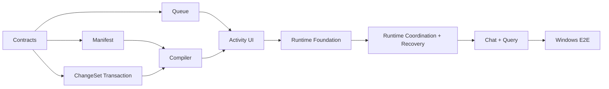

# Personal Knowledge OS Execution Plan / Windows 执行计划

Status: Active

Last updated: 2026-07-17

Target platform: Obsidian Desktop on Windows

本计划把 [`PERSONAL_KNOWLEDGE_OS_PRD.md`](./PERSONAL_KNOWLEDGE_OS_PRD.md) 的 Golden Flow 转换为可连续提交、逐步验收的工程路线。任务状态以 [`../TODO.md`](../TODO.md) 为准，架构契约以 [`PERSONAL_KNOWLEDGE_AGENT_SOLUTION.md`](./PERSONAL_KNOWLEDGE_AGENT_SOLUTION.md) 为准。

Current checkpoint: Commit A/B/C/D/E/F/G foundations and the G.1 runtime adapter foundation are implemented. G.1 adds a strict shared runtime envelope, Queue/Review/Manifest/Transaction/input-revision facades, safe first-file publication, and create/update file CAS code while deliberately leaving Knowledge Studio unavailable. Commit G.2 is next: it owns the exact apply-commit ledger, startup/no-journal recovery, workflow wiring, and Windows adapter acceptance gate; Commit H follows only after G.2 safely enables the runtime workflow. The repository currently passes 2,794 unit tests across 151 Jest suites, TypeScript `noEmit`, repository-wide ESLint, and changed-file Prettier checks; details are recorded in [`../TODO.md`](../TODO.md). Repository-wide Prettier still has only the pre-existing, untouched `src/LLMProviders/chatModelManager.ts` baseline. No source code from the audited external candidates has been copied; attribution status is recorded in [`../THIRD_PARTY_NOTICES.md`](../THIRD_PARTY_NOTICES.md).

---

## 1. Outcome and Strategy

首个可用结果必须让一个真实来源完成完整复利闭环：

```text
Windows Explorer / Vault source
→ Add to Knowledge
→ durable queue
→ two-stage compile
→ multi-file ChangeSet review
→ recoverable write
→ grounded query + citation jump
→ unchanged source skip
```

执行策略：

1. 以 vertical slice 验收，不把 parser、queue、UI 分别做成永远无法使用的半成品。
2. 纯知识契约先行，Obsidian、Windows、模型和 UI 通过 adapter 接入。
3. 先保证来源、幂等、删除、引用和恢复语义，再增加自动化程度。
4. 复用当前 Search v3、ApplyView、Chat 文件拖入和进度 UI，不建立重复基础设施。
5. 外部代码先进入归属台账，再按 Copy / Port / Reference 实施。

## 2. Roadmap: Now / Next / Later

| Stage | Initiative                     | Desired outcome                          | Exit metric                             | Effort |
| ----- | ------------------------------ | ---------------------------------------- | --------------------------------------- | ------ |
| Now   | Slice 1A — Knowledge contracts | 所有后续模块共享稳定、可验证的数据语义   | 契约和 Windows fixtures 全部通过        | S      |
| Now   | Slice 1B — Queue and recovery  | 任务可见、可暂停、可恢复，不重复调用模型 | 重启/失败/重复来源状态测试通过          | M      |
| Now   | Slice 1C — Golden Flow         | 一个真实来源成为可引用、可复用的 Wiki    | 端到端 Windows fixture 和实机流程通过   | L      |
| Next  | Daily Knowledge Studio         | 用户每天可管理来源、审核、活动和健康状态 | 完成一周真实 Vault 使用且无人工修库     | L      |
| Next  | Retrieval and maintenance      | 新知识能稳定找回，陈旧和冲突可处理       | citation、reuse、lint 基准达到 PRD 门槛 | M      |
| Later | Graph exploration              | 图谱改善检索和知识缺口发现，而非只做展示 | 图增强任务集优于无图基线                | L      |
| Later | Temporal/Graphiti projection   | 历史状态和多跳关系确实需要外部投影       | 达到 PRD 中 Graphiti 接入门槛           | L      |

`Now` 是当前提交序列；`Next` 只有在 Golden Flow 被真实使用后才锁定细节；`Later` 是带门槛的探索，不是承诺。

## 3. NOW — Commit-by-commit Execution

### Commit A — Execution Baseline ✅

Scope:

- 固定本执行计划与 Windows-only 验收矩阵。
- 建立 `THIRD_PARTY_NOTICES.md` 与许可证存放规则。
- 建立 `src/knowledge/` 的依赖方向和公共导出边界。

Exit criteria:

- 外部来源、commit、许可证和本地目标可追踪。
- 尚未复制的项目明确标记为 audited/reference，不错误声明已包含其代码。
- 新模块不依赖 Settings singleton、Vault global、Provider Manager 或 React。

### Commit B — Contracts and Validation ✅

Target files:

```text
src/knowledge/
├── manifest/
│   ├── freshness.ts
│   └── freshness.test.ts
├── model/
│   ├── types.ts
│   ├── schemas.ts
│   ├── validation.ts
│   ├── fingerprint.ts
│   ├── schemas.test.ts
│   ├── validation.test.ts
│   └── fingerprint.test.ts
├── paths/
│   ├── vaultPath.ts
│   └── vaultPath.test.ts
└── index.ts
```

Scope:

- `KnowledgeBundleConfig`
- `SourceManifestEntry`
- `SourceLocator` / `ClaimCitation`
- `KnowledgeIngestJob`
- discriminated `KnowledgeFileChange`
- `KnowledgeChangeSet`
- Vault-relative path、locator、ChangeSet 和 Bundle deterministic validation
- exact source byte hash、binary/PDF hash 与 pipeline fingerprint

Exit criteria:

- create/update/delete 无歧义；update/delete 强制 before hash。
- Markdown line、heading、PDF page 和 quote locator 的必填字段由类型与 validator 共同保证。
- Pipeline fingerprint 对字段顺序稳定，对 schema/parser/compiler/model/output 变化敏感。
- 无 Obsidian、Node filesystem、模型或 UI import。

### Commit C — Source Manifest and Repository Port ✅

Target files:

```text
src/knowledge/manifest/
├── SourceManifestRepository.ts
├── SourceManifestStorage.ts
└── *.test.ts
```

Scope:

- 版本化 manifest schema 与宽容读取。
- output existence、source hash、pipeline fingerprint 和 stale 判断。
- 通过 storage port 注入读写；Vault adapter 后置。
- 保留未知扩展字段，拒绝不兼容 major schema version。

Exit criteria:

- 相同 source + fingerprint + 完整输出返回 `up_to_date`。
- 输出缺失、fingerprint 变化或 source hash 变化返回明确 stale reason。
- 失败运行不覆盖 last successful state。

### Commit D — Persistent Queue Core ✅

Target files:

```text
src/knowledge/ingest/queue/
├── IngestQueue.ts
├── QueueStorage.ts
├── RetryPolicy.ts
└── *.test.ts
```

Scope:

- pending/processing/paused/review/failed/completed/cancelled 状态机。
- 同一 source 去重；processing 时变化只安排一次 rerun；claim 外的 durable source high-watermark 拒绝乱序到达的旧观察。
- `AbortController`、指数退避、jitter、最大重试和 provider 限流暂停。
- 非 applying 的 processing 在启动恢复时回到 pending，backlog 默认等待用户操作。
- 每次执行使用 attempt/startedAt claim ownership；旧 attempt 的迟到结果只返回 stale。
- 来源新旧由 adapter 分配、跨重启持久化的 per-source `inputRevision` 判定，Queue 另行持久 revision/hash/pipeline high-watermark，不依赖 Windows 墙上时钟。
- Queue snapshot 采用 strict、显式版本化 schema；持久结构扩展必须通过版本升级和迁移完成。
- applying 在 Commit E 的事务日志可用前 fail closed，并保持不可绕过的 recovery-required gate。

Exit criteria:

- 任一状态迁移均有测试；非法迁移 fail closed。
- 项目切换和重启不丢 job、不产生重复 active job；中断 attempt 采用 at-least-once，可能重放模型调用。
- 取消不会删除已经存在或被多个来源共享的页面。

### Commit E — Recoverable ChangeSet Application ✅

Target files:

```text
src/knowledge/changeset/
├── ApplyCommitCoordinator.ts
├── ChangeSetValidator.ts
├── ChangeSetTransaction.ts
├── TransactionStorage.ts
└── *.test.ts
```

Scope:

- 路径越界、重复/重叠目标、before-hash 冲突和 citation/link/OKF validation。
- 完整 pre-state、accepted ChangeSet 和 Bundle boundary 进入 Vault-global 单活动 journal。
- Windows deterministic write order、单文件原子 compare-and-swap、写后复验、commit marker 和幂等 startup roll-forward。
- divergent file state 进入 sticky `recovery_required`，不自动 rollback、不覆盖并发用户编辑。
- Transaction journal v2 将 source id、source hash、pipeline fingerprint、input revision 与 job attempt/start 绑定为完整 claim；ChangeSet 必须引用该 source。
- applying executor 必须返回 `completed + exact commitReceipt`；`IngestQueue.runNext` 只对外转换为 `commit_ready`，不能直接把 durable Queue job 标为 completed。审核接受先进入新的 durable applying claim，同样走 transaction/coordinator。
- Queue snapshot v3 以 exact `applyClaim`、pending review anchor、review rejection tombstone 和 `commit_pending_ack` marker 连接 Review Store、active/recovered apply 与 committed journal；审核路径绑定 proposal/accepted digest、terminal revision/time 和完整 job claim。v1/v2 无法证明的 review/apply identity 以 `legacy_unverified` 明确 fail closed。
- 固定 `queue claim verify → manifest → queue marker → journal ack → queue release` 的协议；前者只读，后四步持久且均可在崩溃后重试收敛。
- 明确 Obsidian Vault API 不提供真正跨文件原子性。

Exit criteria:

- 崩溃注入覆盖每个写入阶段。
- 纯事务与协调器层已证明：页面 commit marker 之前不会推进任务或 Manifest 成功，任一账本断点均可重试。
- Raw Source target 永远被拒绝，除非未来出现独立显式动作契约。

Runtime integration boundary before real Vault writes:

- 首个真实 Windows adapter/UI 必须同步加入 Windows Desktop platform guard、非支持平台用户提示，并明确更新 `manifest.json` 的 desktop-only 决策与相应用户文档。
- 实现 Windows/Vault `TransactionStorage`、`QueueStorage` 与 `KnowledgeFileStore.compareAndSwap` adapter；compare-and-delete 同样必须原子，不能用普通 read + delete 冒充。
- 实现 `ApplyCommitManifestPort` 的 exact-idempotency adapter/ledger；必须按 transaction id/revision、ChangeSet digest 与 receipt 防重，且对同 key 不同 payload fail closed。
- journal 化并复证 schema、非 target link、source artifact 和 manifest target authorization 的 semantic read-set，避免崩溃恢复时依赖已经漂移；在 ownership/sourceRefs/last-generated hash 可于 apply-time 复证前，不在真实 UI 启用 compiler delete。
- 在接入真实写盘前决定 mutation intent：当前 content-addressed at-least-once 恢复存在“CAS 后、progress 前崩溃，再被用户恢复为精确 before”这一 ABA 取舍。
- 为 `recovery_required` 增加明确的重新校验、继续、回滚或放弃操作；在此之前冲突只保持 fail closed。
- 在重新 claim startup backlog 前扫描 durable Review Store，并用 `reconcilePendingReview` 收敛“proposal 已落盘、Queue hand-off 未落盘”的旧 attempt。
- 为 accepted apply claim 已落盘但 journal 尚未创建的 crash window 增加 no-journal verify/continue/abandon；没有写入 intent 证明时不得自动重试。
- terminal archive 必须同时协调 Queue jobs、pending/terminal review identity、Review Store 与 source high-watermark，或保留等价 tombstone。

### Commit F — Provider-neutral Compile Port ✅

Target files:

```text
src/knowledge/compiler/
├── KnowledgeCompiler.ts
├── CompilerModelPort.ts
├── analysisSchema.ts
├── generationSchema.ts
└── *.test.ts
```

Scope:

- 阶段一输出概念、实体、主张、关系、引用和目标页面集合。
- 阶段一只可读取 caller-owned target catalog 中的既有页面；catalog 外路径保持 create-only，Windows existence probe 发现占用即 fail closed。
- delete 只允许 manifest 标记为 generated、当前 source 独占且 bytes 匹配 last-generated hash 的显式授权目标。
- 阶段二只接收 runtime 绑定后的 create/update 最小 DTO，并只能用 opaque target id 返回 write/unchanged；delete 内容和授权元数据不进入生成模型。
- 模型输出经过结构校验、路径校验和 citation normalization。
- claim 必须至少有一条 trusted evidence 的 material-valid `supports`；引用 identity、locator 和 hash 不由模型填写。
- OKF、link 与 citation candidate validator 是构造 proposed ChangeSet 的必需端口；apply-time 仍独立复验。
- Provider 和模型配置通过 port 注入；不复制外部 Provider Runtime。
- Compiler source identity 包含单调 `inputRevision`，因此来源内容 A→B→A 仍生成不同 ChangeSet/review instance，不复用旧审核。

Constraint:

- 本提交先实现接口、结构化 schema 和 deterministic orchestration。任何新增或修改 AI prompt 内容遵守仓库规则，只有在用户明确授权后单独提交。

Exit criteria:

- 模型不能绕过 runtime target binding 修改既有未授权路径；新路径只有在 Windows resolver 证明缺失后才能进入 create proposal。
- 无效或不完整输出进入 review/failure，不直接写盘。
- 固定 fake model fixture 可以产生稳定 ChangeSet。

### Commit G — Multi-file Review and Activity UI ← Core/UI implemented; Windows interaction validation pending Commit I

Scope:

- 从 ApplyView 抽取无写入能力的 diff renderer；legacy 单文件执行路径保持隔离。
- 增加 strict durable Review Store、opaque review command 与选择后重新 hash/validation。
- Queue 只有在收到同 Bundle、同 exact job claim 的 durable pending Review Store receipt 后才能进入 `awaiting_review`；accepted/rejected receipt 必须把 record revision 从 0 精确推进到 1。
- 同一 accepted receipt 在 active applying claim 内重放不增加 Queue revision/event；proposal、digest、revision、time、Bundle 或 job claim 冲突均 fail closed。
- `awaiting_review` 不允许通用 Cancel；Reject 必须先 durable persist，再原子移除 pending anchor、保留 rejection tombstone 并提升 latest rerun。
- 提供 `reconcilePendingReview` 关闭 Review Store 已写而 Queue hand-off 未写的崩溃窗口；旧版 `legacy_unverified` anchor 只能由精确 pending record 升级。
- 复用 ProcessingStatus/IndexingProgressCard 视觉语言显示任务阶段、finalizing 与 recovery gate。
- 增加 Windows-only Knowledge Studio 最小 ItemView：Activity、ChangeSet Review、完成摘要；真实 Vault adapter 接入前 fail closed。
- 遵守 popout-window 的 `.doc/.win` 和 `onWindowMigrated` 规则。

Exit criteria:

- 用户能逐文件、逐块或批量接受/拒绝；delete 有单独危险语义且当前不可接受。
- UI 不展示任务成功，直到 commit marker 完成。
- Windows 触控板、键盘和不同窗口均可完成审核。

### Commit G.1 — Windows Runtime Adapter Foundation ← Code implemented; product gate remains closed

Scope:

- 用插件私有 `knowledge-runtime-v1.json` strict envelope 承载 Queue、Review、Manifest、Vault-global active transaction 与 per-source watcher-capture `inputRevision`。
- 每个 facade 的 revision/token compare 和完整 snapshot 替换在同一 `DataAdapter.process` transform 内完成；任何 slot 损坏会阻止整个 envelope 改写。
- source watcher 的契约固定为“先分配 revision，再做异步 read/parse”，Queue high-watermark 拒绝较晚完成的旧读取。
- 首次 runtime 文件经完整临时文件、handle flush 和排他 hard-link 发布；parent realpath 必须留在真实 Vault 根内。
- `KnowledgeFileStore` capability 绑定具体 store；Windows store 只启用排他 create 与 `Vault.process` update，delete fail closed，但能分类 already-missing replay 和第三状态 conflict。
- Windows plugin load 初始化 singleton state foundation，但继续注入 `UnavailableKnowledgeStudioPort`；不实例化真实 ingest/compiler/apply/query coordinator。

Verified in automated code-level tests:

- runtime reconstruction 后 revision 继续递增，Bundle/source namespace 隔离，并发分配不重复。
- 较新事件先完成、较旧读取后完成时，Queue 保留较高 revision/hash。
- 不同 subsystem 并发更新不丢失；queue/review/manifest/transaction/duplicate/unknown-version corruption 均阻止 unrelated write 且不改 bytes。
- 首次发布并发不覆盖、missing parent 与 symlink escape fail closed；Wiki create/update race、malformed payload、external error 与 delete replay 分类被覆盖。

Remaining exit gates:

- 在真实 Windows Obsidian test Vault 验证 `DataAdapter.process`/`Vault.process` 的双实例序列化、callback/返回值、插件重载、外部编辑、NTFS/OneDrive/junction 和 crash/power-loss 行为；自动化测试不能替代该结论。
- 实现 exact `ApplyCommitManifestPort` ledger、semantic read-set、startup Review reconciliation、no-journal recovery、history compaction/size threshold 和 safe compare-and-delete，或继续保持 delete unavailable。
- 当前单 envelope 有 O(size) 写放大和共享故障域；长期使用前必须通过 size/latency benchmark 决定 archive 与分片。
- 完成这些门槛前，不把基础代码称为可用 Golden Flow 或 production-ready durable adapter。

### Commit G.2 — Runtime Coordination and Recovery ← Next

Scope:

- 实现 exact `ApplyCommitManifestPort` ledger，并把 queue/review/manifest/transaction facades、file store、compiler 与 startup coordinator 组装成 plugin singleton workflow。
- 启动时先验证 runtime envelope，扫描 active journal、apply claim、commit marker 与 Review Store，再执行 pending-review reconciliation；完成前不能 claim 新任务。
- 关闭 accepted apply claim 已落盘但 journal 尚未创建的窗口，提供 no-journal verify/continue/abandon；不能凭“没有 journal”自动推断未写盘。
- journal 化并复证 schema、non-target links、source artifact 与 manifest ownership/last-generated hash read-set；delete 可继续保持 unavailable，不能为了过门槛降级为 read-then-delete。
- 为 `recovery_required` 提供显式 revalidate/continue/rollback/abandon core 与 UI，所有 divergent file state 继续 fail closed。
- 定义 envelope size/latency guard、协调 terminal archive/compaction；超过门槛时暂停新 ingest，而不是让 Obsidian UI 无界阻塞。
- 把 file/projection adapter 的 malformed success、filesystem/runtime failure 映射为受控 infrastructure error，用户提示不包含内容、路径外数据或 credential。
- 在独立 Windows Obsidian Vault 验证 process serialization、plugin reload、external edit、NTFS/OneDrive/junction 和 crash recovery；保留可重复验收脚本与结果。

Exit criteria:

- Windows Studio 从 `adapter_unavailable` 切到 ready 前，所有 startup/recovery gate 均有持久证据和测试；任一缺失仍 unavailable。
- `Markdown/PDF → queue → compile → review → create/update → manifest/queue/journal finalize` 可在测试 Vault 重启后收敛，且 delete 仍可安全保持禁用。
- 没有 journal/ledger/read-set 证据的状态只能进入人工恢复，不会自动调用模型或写 Wiki。

### Commit H — Chat Entry, Query, and Citation Jump

Scope:

- Chat 文件拖入增加 `Use in this chat` / `Add to Knowledge`。
- Wiki/index 渐进发现接入当前 Search v3。
- 回答使用 `ClaimCitation`，citation chip 能打开并定位 Markdown heading/line 或 PDF page。
- 增加 `Save to Wiki`，再次通过 ChangeSet review 写回。

Exit criteria:

- 一次使用的附件不会意外进入长期知识。
- 加入知识库的来源立即出现 job card。
- 模型没有实际读取的 artifact 不能成为 citation。

### Commit I — Windows End-to-end Validation

Scope:

- Markdown、中文文件名、CRLF、PDF、相同来源和已变化来源 fixture。
- 盘符/反斜杠、大小写碰撞、保留设备名、尾随点/空格、长路径和文件占用。
- 插件重启、模型失败、before-hash 冲突和事务恢复。
- 在独立 Windows Obsidian test Vault 完成实机验收。

Exit criteria:

- PRD First Vertical Slice 的 acceptance criteria 全部通过。
- `.env.test` 和 API key 不进入提交、日志、fixture 或错误消息。
- 记录首个 baseline：完成时间、模型调用数、citation navigation、accept/edit/reject。

## 4. Dependency Order



可以并行的只有：

- Manifest 与 Queue core；
- UI shell 与 fake compiler fixture；
- Windows fixture 准备与纯模型契约测试。

不能提前的工作：

- 没有 ChangeSet transaction 前，不接真实模型写盘。
- 没有 citation locator 前，不做“带来源回答”演示。
- 没有真实检索收益基线前，不建设完整 Sigma 图谱。
- 没有历史查询压力前，不部署 Graphiti。

## 5. Quality Gates

每个提交至少通过：

- 相关 Jest tests。
- TypeScript type check。
- Prettier format check。
- ESLint。
- `git diff --check`。
- 不包含密钥和无关用户文件。

Golden Flow 额外门槛：

- Raw Source 非授权写入为 0。
- Project/Bundle scope leakage 为 0。
- 无效 citation 为 0。
- 相同 source + fingerprint 的模型调用为 0。
- 恢复后错误 success marker 为 0。

## 6. Decision and Escalation Rules

- 小型纯逻辑模块可以直接 Copy，但 attribution、license 和 tests 必须同提交进入。
- 外部模块需要自己的 Runtime、数据库或状态系统时，默认 Port 契约，不整体嵌入。
- 新依赖必须回答：当前模块为何不能实现、bundle/启动/升级成本、Windows Runtime 兼容性和卸载恢复方式。
- 任何会修改 AI prompt、启用真实外部副作用、改变整个插件平台声明或引入常驻服务的步骤，单独提交并明确说明。
- 真实实现与本文冲突时，先更新决策和 TODO，再继续编码，不让文档长期失真。
