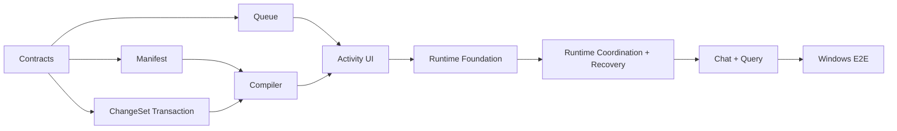

# Personal Knowledge OS Execution Plan / Windows 执行计划

Status: Active

Last updated: 2026-08-05

Target platform: Obsidian Desktop on Windows

本计划把 [`PERSONAL_KNOWLEDGE_OS_PRD.md`](./PERSONAL_KNOWLEDGE_OS_PRD.md) 的 Golden Flow 转换为可连续提交、逐步验收的工程路线。任务状态以 [`../TODO.md`](../TODO.md) 为准，架构契约以 [`PERSONAL_KNOWLEDGE_AGENT_SOLUTION.md`](./PERSONAL_KNOWLEDGE_AGENT_SOLUTION.md) 为准。

Current checkpoint: Commit A–G.1, the production G.2z-d compile/Review/explicit create-update Apply/limited Recovery paths, and Commit H.1 scoped Query are implemented. The G.2z-d command matrix and H.1 have passed bounded code, automated, and Windows interaction gates. The plugin performs strict Bundle discovery, zero-network preflight, owner-first recovery, listener-first source observation, fresh Gate/conditional release, exact-byte parsing, isolated two-stage DeepSeek compilation, deterministic candidate validation, and durable Review-before-Queue hand-off. The generation-owned worker is installed by `main.ts` only after release and drains durable Queue work to `awaiting_review`; the worker itself still has no Review-decision, fresh transaction, Wiki mutation, recovery-decision, or query authority. Separate generation-owned Studio boundaries expose exact Activity mutations, Review Reject, explicit reviewed create/update Accept → Queue apply claim → transaction Apply → commit finalization, only the narrowly proved Recovery actions, and read-only Query over exact accepted/applied Wiki pages with opaque Markdown citation navigation. Delete, model synthesis, Query writeback, PDF navigation, and every auto-accept/auto-apply policy remain unavailable.

The G.2y Windows acceptance slice passed in an independent Obsidian Vault through durable `awaiting_review`: first Runtime publication, later `DataAdapter.process`, Manifest CAS, source crawl, exact-byte UTF-8 parsing, two successful DeepSeek requests, candidate validation, durable Review/Queue identity, zero-request reload, and disable-time cancellation/retry recovery were observed while Wiki bytes, Manifest success state, and the transaction slot stayed unchanged. G.2z-a/b/c live read and narrow command acceptance also passed there. G.2z-d then completed fresh create, block-selected update, external-edit fail-closed behavior, explicit no-journal Recovery Continue, full finalization, and full-application cold-reload idempotence without hand-editing Runtime. H.1 subsequently completed two real Query form submissions, a current opaque Markdown quote jump with exact editor selection, and a before/after Runtime/Wiki/Source hash equality check. This remains bounded evidence rather than a claim of general filesystem durability: broader external-editor and dual-instance races, NTFS/OneDrive/junction behavior, and crash and power-loss recovery remain separate gates.

G.2z-a/b established the same-generation read-only Studio baseline after successful admission. Queue and Review are projected from one atomic Runtime envelope; only Queue-anchored pending records are shown. Current Wiki targets are then observed and the outer Runtime revision is reread, so a concurrent mutation causes a bounded full retry rather than a mixed Review snapshot. Runtime and Wiki events are reload hints only. A revocable read-generation lease subscribes before delegate installation; Composer closure or invalidation synchronously restores the unavailable delegate and unbinds Runtime/Vault listeners. For one uniquely selected Bundle, Activity and Review are live durable data; for multiple Bundles without a selector, Studio remains unavailable.

G.2z-c upgraded that baseline with a narrow Windows live-command boundary. Pause, Resume, Cancel, and Retry carry the exact Queue revision from the rendered snapshot and never rebase a stale command. Whole-proposal Reject accepts only a complete set of literal `reject` decisions, then updates the pending Review record and exact Queue job/anchor/tombstone together in one Runtime transform. Exact terminal replay and commit-then-throw reread are idempotent; Reject performs zero Wiki writes and does not mutate Manifest, journal, or apply-ledger state. At that checkpoint Accept, mixed/block-level decisions, fresh Apply, recovery commands, and Query remained false and fail-closed. Conditional release preserves an existing user/rate-limit pause while admitting the safely proved live generation; the authoritative startup crawl may still append new same-content source observations by design. `startup_recovery`, `recovery_required`, and `commit_pending_ack` remain unavailable to ordinary Resume.

G.2z-d connects explicit reviewed create/update Accept → exact Queue apply claim → transaction Apply → `ApplyCommitCoordinator` finalization. Acceptance re-observes the rendered targets, reconstructs the selected candidate from opaque decisions, repeats deterministic candidate and transaction validation, and never grants Apply authority to the background worker. The Recovery tab projects one atomic Runtime observation: `accepted_not_started` allows Continue; Core `requires_decision` is projected as UI `decision_required` and allows Continue or Abandon; active, blocked, finalizing, Queue-level, and Vault-global transaction states allow only recheck. There is no generic rollback, no automatic Apply, and delete remains disabled. Its bounded Windows acceptance has passed. H.1 projects current applied provenance atomically, revalidates exact Wiki hashes, searches only that in-memory corpus, and opens hash-verified Markdown locators through opaque references; its bounded Windows interaction acceptance has also passed. Model synthesis, Save to Wiki, and PDF navigation remain later work. Verification details are recorded in [`../TODO.md`](../TODO.md). No source code from the audited external candidates has been copied; attribution status is recorded in [`../THIRD_PARTY_NOTICES.md`](../THIRD_PARTY_NOTICES.md).

---

## 1. Outcome and Strategy

首个可用结果必须让一个真实来源完成完整复利闭环：

```text
Windows Explorer / Vault source
→ Add to Knowledge
→ durable queue
→ two-stage compile
→ multi-file ChangeSet review
→ recoverable write
→ grounded query + citation jump
→ unchanged source skip
```

执行策略：

1. 以 vertical slice 验收，不把 parser、queue、UI 分别做成永远无法使用的半成品。
2. 纯知识契约先行，Obsidian、Windows、模型和 UI 通过 adapter 接入。
3. 先保证来源、幂等、删除、引用和恢复语义，再增加自动化程度。
4. 复用当前 Search v3、ApplyView、Chat 文件拖入和进度 UI，不建立重复基础设施。
5. 外部代码先进入归属台账，再按 Copy / Port / Reference 实施。

## 2. Roadmap: Now / Next / Later

| Stage | Initiative                     | Desired outcome                          | Exit metric                             | Effort |
| ----- | ------------------------------ | ---------------------------------------- | --------------------------------------- | ------ |
| Now   | Slice 1A — Knowledge contracts | 所有后续模块共享稳定、可验证的数据语义   | 契约和 Windows fixtures 全部通过        | S      |
| Now   | Slice 1B — Queue and recovery  | 任务可见、可暂停、可恢复，不重复调用模型 | 重启/失败/重复来源状态测试通过          | M      |
| Now   | Slice 1C — Golden Flow         | 一个真实来源成为可引用、可复用的 Wiki    | 端到端 Windows fixture 和实机流程通过   | L      |
| Next  | Daily Knowledge Studio         | 用户每天可管理来源、审核、活动和健康状态 | 完成一周真实 Vault 使用且无人工修库     | L      |
| Next  | Retrieval and maintenance      | 新知识能稳定找回，陈旧和冲突可处理       | citation、reuse、lint 基准达到 PRD 门槛 | M      |
| Later | Graph exploration              | 图谱改善检索和知识缺口发现，而非只做展示 | 图增强任务集优于无图基线                | L      |
| Later | Temporal/Graphiti projection   | 历史状态和多跳关系确实需要外部投影       | 达到 PRD 中 Graphiti 接入门槛           | L      |

`Now` 是当前提交序列；`Next` 只有在 Golden Flow 被真实使用后才锁定细节；`Later` 是带门槛的探索，不是承诺。

## 3. NOW — Commit-by-commit Execution

### Commit A — Execution Baseline ✅

Scope:

- 固定本执行计划与 Windows-only 验收矩阵。
- 建立 `THIRD_PARTY_NOTICES.md` 与许可证存放规则。
- 建立 `src/knowledge/` 的依赖方向和公共导出边界。

Exit criteria:

- 外部来源、commit、许可证和本地目标可追踪。
- 尚未复制的项目明确标记为 audited/reference，不错误声明已包含其代码。
- 新模块不依赖 Settings singleton、Vault global、Provider Manager 或 React。

### Commit B — Contracts and Validation ✅

Target files:

```text
src/knowledge/
├── manifest/
│   ├── freshness.ts
│   └── freshness.test.ts
├── model/
│   ├── types.ts
│   ├── schemas.ts
│   ├── validation.ts
│   ├── fingerprint.ts
│   ├── schemas.test.ts
│   ├── validation.test.ts
│   └── fingerprint.test.ts
├── paths/
│   ├── vaultPath.ts
│   └── vaultPath.test.ts
└── index.ts
```

Scope:

- `KnowledgeBundleConfig`
- `SourceManifestEntry`
- `SourceLocator` / `ClaimCitation`
- `KnowledgeIngestJob`
- discriminated `KnowledgeFileChange`
- `KnowledgeChangeSet`
- Vault-relative path、locator、ChangeSet 和 Bundle deterministic validation
- exact source byte hash、binary/PDF hash 与 pipeline fingerprint

Exit criteria:

- create/update/delete 无歧义；update/delete 强制 before hash。
- Markdown line、heading、PDF page 和 quote locator 的必填字段由类型与 validator 共同保证。
- Pipeline fingerprint 对字段顺序稳定，对 schema/parser/compiler/model/output 变化敏感。
- 无 Obsidian、Node filesystem、模型或 UI import。

### Commit C — Source Manifest and Repository Port ✅

Target files:

```text
src/knowledge/manifest/
├── SourceManifestRepository.ts
├── SourceManifestStorage.ts
└── *.test.ts
```

Scope:

- 版本化 manifest schema 与宽容读取。
- output existence、source hash、pipeline fingerprint 和 stale 判断。
- 通过 storage port 注入读写；Vault adapter 后置。
- 保留未知扩展字段，拒绝不兼容 major schema version。

Exit criteria:

- 相同 source + fingerprint + 完整输出返回 `up_to_date`。
- 输出缺失、fingerprint 变化或 source hash 变化返回明确 stale reason。
- 失败运行不覆盖 last successful state。

### Commit D — Persistent Queue Core ✅

Target files:

```text
src/knowledge/ingest/queue/
├── IngestQueue.ts
├── QueueStorage.ts
├── RetryPolicy.ts
└── *.test.ts
```

Scope:

- pending/processing/paused/review/failed/completed/cancelled 状态机。
- 同一 source 去重；processing 时变化只安排一次 rerun；claim 外的 durable source high-watermark 拒绝乱序到达的旧观察。
- `AbortController`、指数退避、jitter、最大重试和 provider 限流暂停。
- 非 applying 的 processing 在启动恢复时回到 pending，backlog 默认等待用户操作。
- 每次执行使用 attempt/startedAt claim ownership；旧 attempt 的迟到结果只返回 stale。
- 来源新旧由 adapter 分配、跨重启持久化的 per-source `inputRevision` 判定，Queue 另行持久 revision/hash/pipeline high-watermark，不依赖 Windows 墙上时钟。
- Queue snapshot 采用 strict、显式版本化 schema；持久结构扩展必须通过版本升级和迁移完成。
- applying 在 Commit E 的事务日志可用前 fail closed，并保持不可绕过的 recovery-required gate。

Exit criteria:

- 任一状态迁移均有测试；非法迁移 fail closed。
- 项目切换和重启不丢 job、不产生重复 active job；中断 attempt 采用 at-least-once，可能重放模型调用。
- 取消不会删除已经存在或被多个来源共享的页面。

### Commit E — Recoverable ChangeSet Application ✅

Target files:

```text
src/knowledge/changeset/
├── ApplyCommitCoordinator.ts
├── ChangeSetValidator.ts
├── ChangeSetTransaction.ts
├── TransactionStorage.ts
└── *.test.ts
```

Scope:

- 路径越界、重复/重叠目标、before-hash 冲突和 citation/link/OKF validation。
- 完整 pre-state、accepted ChangeSet 和 Bundle boundary 进入 Vault-global 单活动 journal。
- Windows deterministic write order、单文件原子 compare-and-swap、写后复验、commit marker 和幂等 startup roll-forward。
- divergent file state 进入 sticky `recovery_required`，不自动 rollback、不覆盖并发用户编辑。
- Transaction journal v3 将 source id、source hash、pipeline fingerprint、input revision 与 job attempt/start 绑定为完整 claim，并持久化回链 Review plan 的最终 Manifest intent；ChangeSet 必须引用该 source。
- applying executor 必须返回 `completed + exact commitReceipt`；`IngestQueue.runNext` 只对外转换为 `commit_ready`，不能直接把 durable Queue job 标为 completed。审核接受先进入新的 durable applying claim，同样走 transaction/coordinator。
- Queue snapshot v4 以 exact `applyClaim`、pending review anchor、review rejection tombstone 和 `commit_pending_ack` marker 连接 Review Store、active/recovered apply 与 committed journal；审核路径绑定 proposal/accepted/Manifest-intent digest、terminal revision/time 和完整 job claim。v1/v2 无法证明的 review/apply identity，以及 v3 缺失 intent digest 的在途审核，以 `legacy_unverified` 明确 fail closed。
- 固定 `queue claim verify → atomic authority reproof+manifest+ledger → queue marker → journal ack → queue release` 的协议；最终 callback 已从同一 envelope 交叉验证 exact Queue claim、accepted Review payload/intent 及 allocator/source high-watermark，关闭独立只读核验后的竞争窗口。
- 直接 apply 在任何 target observation 前先通过 authority port 复证 Queue/Review/high-watermark/allocator 与 Manifest read-set/source ordering；prepared journal 发布在同一 atomic transform 内重复证明。prepared → applying、启动读取 prepared/applying journal 和活动事务期间每次 shared-envelope mutation 都保留该完整 reservation；旧 v3 审核或 stale Manifest 事务在任何新文件 observation/mutation 前停止。Queue commit marker 还必须在 runtime parse 时精确匹配 success ledger，retained rerun 必须等于 source high-watermark。
- 明确 Obsidian Vault API 不提供真正跨文件原子性。

Exit criteria:

- 崩溃注入覆盖每个写入阶段。
- 纯事务与协调器层已证明：页面 commit marker 之前不会推进任务或 Manifest 成功；已有 journal、ledger 或 Queue marker 持久证据的断点可按 exact identity 重试。
- Raw Source target 永远被拒绝，除非未来出现独立显式动作契约。

Runtime integration boundary before real Vault writes:

- Windows Desktop platform guard、非支持平台提示和 `manifest.json` 保持非 desktop-only 的代码/文档决定已完成；compile-to-Review、fresh reviewed create/update Apply 和一次 no-journal Recovery Continue 都已有独立 Windows test Vault evidence，完整 Recovery action matrix 由自动化覆盖。
- Windows/Vault `TransactionStorage`、`QueueStorage` 与 create/update `KnowledgeFileStore.compareAndSwap` adapter 已在 bounded Windows 流程中完成 fresh write、external-before-hash 拒绝、finalization 和冷重载验收；这不替代双实例竞争、NTFS/OneDrive/junction 或 crash/power-loss 门槛。compare-and-delete 仍必须原子，不能用普通 read + delete 冒充。
- [x] 实现 `ApplyCommitManifestPort` 的 exact-idempotency adapter/ledger；按 transaction id/revision、ChangeSet/intent/journal/receipt digest 防重，同 key 不同 payload fail closed，Manifest success 与 ledger 在一个 transform 中发布。
- [x] 已 journal 化并复证 Manifest target authorization（revision/digest、ownership/sourceRefs、last-generated hash）；首代 create/update Apply 还会重读 exact parser artifacts，并重复验证 schema-constrained OKF 与 linkless projection。未来开放 outbound links 或 delete 前须扩展相应 semantic read-set；safe compare-delete 完成前保持 compiler delete unavailable。
- 在接入真实写盘前决定 mutation intent：当前 content-addressed at-least-once 恢复存在“CAS 后、progress 前崩溃，再被用户恢复为精确 before”这一 ABA 取舍。
- 已为可证明的 no-journal 窗口接入显式 Continue/Abandon：Core `accepted_not_started` 只允许 Continue，Core `requires_decision`（UI 投影为 `decision_required`）才允许 Continue 或 Abandon。active/blocked/finalizing/Queue/global transaction 只允许 recheck；divergent state 保持 fail closed，且没有通用 rollback。
- 在重新 claim startup backlog 前扫描 durable Review Store，并用 `reconcilePendingReview` 收敛“proposal 已落盘、Queue hand-off 未落盘”的旧 attempt。
- [x] 为 accepted apply claim 已落盘但 journal 尚未创建的 crash window 增加 no-journal classify/continue/abandon Core，并完成 production startup/Studio 接线；没有精确恢复证据时不得自动重试。
- terminal archive 必须同时协调 Queue jobs、pending/terminal review identity、Review Store 与 source high-watermark，或保留等价 tombstone。

### Commit F — Provider-neutral Compile Port ✅

Target files:

```text
src/knowledge/compiler/
├── KnowledgeCompiler.ts
├── CompilerModelPort.ts
├── analysisSchema.ts
├── generationSchema.ts
└── *.test.ts
```

Scope:

- 阶段一输出概念、实体、主张、关系、引用和目标页面集合。
- 阶段一只可读取 caller-owned target catalog 中的既有页面；catalog 外路径保持 create-only，Windows existence probe 发现占用即 fail closed。
- delete 只允许 manifest 标记为 generated、当前 source 独占且 bytes 匹配 last-generated hash 的显式授权目标。
- 阶段二只接收 runtime 绑定后的 create/update 最小 DTO，并只能用 opaque target id 返回 write/unchanged；delete 内容和授权元数据不进入生成模型。
- 模型输出经过结构校验、路径校验和 citation normalization。
- claim 必须至少有一条 trusted evidence 的 material-valid `supports`；引用 identity、locator 和 hash 不由模型填写。
- OKF、link 与 citation candidate validator 是构造 proposed ChangeSet 的必需端口；apply-time 仍独立复验。
- Provider 和模型配置通过 port 注入；不复制外部 Provider Runtime。
- Compiler source identity 包含单调 `inputRevision`，因此来源内容 A→B→A 仍生成不同 ChangeSet/review instance，不复用旧审核。

Constraint:

- 本提交先实现接口、结构化 schema 和 deterministic orchestration。任何新增或修改 AI prompt 内容遵守仓库规则，只有在用户明确授权后单独提交。

Exit criteria:

- 模型不能绕过 runtime target binding 修改既有未授权路径；新路径只有在 Windows resolver 证明缺失后才能进入 create proposal。
- 无效或不完整输出进入 review/failure，不直接写盘。
- 固定 fake model fixture 可以产生稳定 ChangeSet。

### Commit G — Multi-file Review and Activity UI ← Implemented; bounded Windows interaction passed

Scope:

- 从 ApplyView 抽取无写入能力的 diff renderer；legacy 单文件执行路径保持隔离。
- 增加 strict durable Review Store、opaque review command 与选择后重新 hash/validation。
- Queue 只有在收到同 Bundle、同 exact job claim 的 durable pending Review Store receipt 后才能进入 `awaiting_review`；accepted/rejected receipt 必须把 record revision 从 0 精确推进到 1。
- 同一 accepted receipt 在 active applying claim 内重放不增加 Queue revision/event；proposal、digest、revision、time、Bundle 或 job claim 冲突均 fail closed。
- `awaiting_review` 不允许通用 Cancel；G.2z-c 的 Reject 由 Runtime 在同一 envelope transform 中原子发布 terminal Review、取消 exact Queue job、移除 pending anchor、保留 rejection tombstone，并提升 latest rerun。
- 提供 `reconcilePendingReview` 关闭 Review Store 已写而 Queue hand-off 未写的崩溃窗口；旧版 `legacy_unverified` anchor 只能由精确 pending record 升级。
- 复用 ProcessingStatus/IndexingProgressCard 视觉语言显示任务阶段、finalizing 与 recovery gate。
- 增加 Windows-only Knowledge Studio 最小 ItemView：Activity、ChangeSet Review、完成摘要；真实 Vault adapter 接入前 fail closed。
- 遵守 popout-window 的 `.doc/.win` 和 `onWindowMigrated` 规则。

Exit criteria:

- 用户能逐文件、逐块或批量接受/拒绝；delete 有单独危险语义且当前不可接受。
- UI 不展示任务成功，直到 commit marker 完成。
- Windows 触控板、键盘和不同窗口均可完成审核。

### Commit G.1 — Windows Runtime Adapter Foundation ← Historical foundation implemented; production gates opened by G.2x–H.1

Scope:

- 用插件私有 `knowledge-runtime-v1.json` strict envelope 承载 Queue、Review、Manifest、Vault-global active transaction 与 per-source watcher-capture `inputRevision`。
- 每个 facade 的 revision/token compare 和完整 snapshot 替换在同一 `DataAdapter.process` transform 内完成；任何 slot 损坏会阻止整个 envelope 改写。
- source watcher 的契约固定为“任何 `await` 前生成全局永久唯一且跨重试稳定的 capture id，并幂等分配 opaque token/revision，再做异步 read/parse，最后 first-write-wins 绑定 exact hash/pipeline”；Queue high-watermark 只有 adapter-private token capability 原子消费 exact bound record 才能推进。Runtime 按 Bundle 枚举 pending allocated/bound work 供重启恢复；历史 consumed capture 重放直接返回自身 terminal receipt，不再次调用 Queue。
- 首次 runtime 文件经完整临时文件、handle flush 和排他 hard-link 发布；parent realpath 必须留在真实 Vault 根内。
- `KnowledgeFileStore` capability 绑定具体 store；Windows store 只启用排他 create 与 `Vault.process` update，delete fail closed，但能分类 already-missing replay 和第三状态 conflict。
- Windows plugin load 初始化 singleton state foundation。G.2 后续已实例化真实 ingest/compiler worker、Studio read delegate 与窄 command adapter；Activity Pause/Resume/Cancel/Retry、Review Reject、显式 reviewed create/update Accept/fresh Apply、受限 Recovery command，以及分离的 scoped Query coordinator 已接入。Query 只读 current applied Wiki，worker 本身仍无 Apply 或 Query 权限；delete、模型综合与 Query writeback 未实例化。

Verified in automated code-level tests:

- runtime reconstruction 后 revision 继续递增，Bundle/source namespace 隔离，并发分配不重复。
- 较新事件先完成、较旧读取后完成时，Queue 保留较高 revision/hash。
- 不同 subsystem 并发更新不丢失；queue/review/manifest/transaction/duplicate/unknown-version corruption 均阻止 unrelated write 且不改 bytes。
- 首次发布并发不覆盖、missing parent 与 symlink escape fail closed；Wiki create/update race、malformed payload、external error 与 delete replay 分类被覆盖。

Remaining exit gates:

- Windows bounded acceptance 已验证首次发布、后续 `DataAdapter.process`、Manifest CAS、插件重载和 compile cancellation/retry，以及 fresh `Vault.process` Wiki create/update、单次外部编辑 fail-closed、no-journal Continue 与冷重载幂等；仍须验证双实例竞争、NTFS/OneDrive/junction 和 crash/power-loss 行为，自动化和这次受控验收都不能替代这些结论。
- startup Review reconciliation、Manifest target read-set、exact `ApplyCommitManifestPort` ledger、commit-boundary Queue/Review/high-watermark 原子复证、no-journal classify/continue/abandon 及其受限 Studio commands、生产 Project Bundle 配置源、外层 plugin Barrier/recovery-only Gate、observation startup Core、同代 workflow lease、production worker、Studio read surface、Activity commands、Review Reject、显式 reviewed create/update Accept/fresh Apply，以及 H.1 scoped Query/Markdown citation jump 已完成代码、自动化与相应 bounded Windows 接线验收；history compaction/size threshold、safe compare-and-delete、模型综合、writeback 与 PDF page jump 仍未完成。
- [x] 在 ready delegate 前完成 Projects lifecycle ownership：ProjectManager 在 state reset 前同步退役；ProjectFileManager、ProjectContextCache、FileCache、ProjectLoadTracker、VaultDataManager 与 project-mode parser 显式捕获 App/Vault；统一 prepared-scan CAS、folder generation、opaque owner/lease 和 lifecycle guard 阻止旧 scan、旧 event/CRUD continuation、旧 cleanup 与 pending-write ABA 发布到新 snapshot。
- 当前单 envelope 有 O(size) 写放大和共享故障域；长期使用前必须通过 size/latency benchmark 决定 archive 与分片。
- 完成这些门槛前，不把基础代码称为可用 Golden Flow 或 production-ready durable adapter。

### Commit G.2 — Runtime Coordination and Recovery ← In progress

Scope:

- [x] 实现 exact `ApplyCommitManifestPort` ledger，并把 Queue/Review/Manifest/transaction facade、Windows file store、Compiler worker、startup coordinator 与 reviewed Apply coordinator 绑定到同一 plugin-owned Runtime generation；fresh reviewed create/update Apply 与一次 no-journal Recovery Continue 已通过 bounded Windows 实机验收，完整 Continue/Abandon matrix 由自动化覆盖。
- 已完成独立的 Review startup coordinator Core：pending record 恢复 Queue anchor；rejected record 在需要时恢复 predecessor 后提交 exact rejection；accepted record 只作为后续 runtime classification identity，启动过程不会自动 apply。协调器用有界 Review revision 重读避免漏掉并发 terminal decision，并将稳定 observed revision 交给最终 startup gate 再复证。
- [x] 补齐 durable Manifest plan/intent：包含完整 post-compile pages、显式 ownership/authorization、Manifest revision/digest read-set 与 source hash/pipeline/`inputRevision`；Review filter/rewrite 只从 immutable plan 投影，journal 不再从 changed targets 猜完整 `lastSuccessful.generatedPages`。
- 启动时先验证 runtime envelope，扫描 active journal、apply claim、commit marker 与 Review Store，再执行 pending-review reconciliation；完成前不能 claim 新任务。
- [x] 关闭 accepted apply claim 已落盘但 journal 尚未创建的 Core 窗口：从同一 envelope 分类 accepted-not-started/active/blocked/finalizing/committed/abandoned，显式 Continue 前重证 Manifest authority，显式 Abandon 前原子证明不存在 journal/commit marker/source-input ledger 并写 Queue v5 tombstone；production startup/Studio 已接线，并只为 `accepted_not_started` 暴露 Continue、为 `decision_required` 暴露 Continue/Abandon。
- [x] 组装纯 TypeScript startup gate：Queue startup recovery → active journal/commit marker 收敛 → Review pending/rejected 收敛 → exact Review revision 下的 Runtime 单-envelope Queue + Vault-global transaction + accepted batch classification；首次 sticky file conflict 只接受同 transaction blocked 归一，Runtime/Queue revision 回退和同 Queue revision 内容分叉均 fail closed，accepted actions/classifications 以共享 recovery id 做无重复一一对应校验，持续 Review churn 有界 fail closed。Gate 不调用 no-journal action、模型或 Queue resume。
- [x] 实现 shared-envelope conditional release：Coordinator 只把 clear Gate 的 Runtime/Review/Queue revision 送回 Runtime；Runtime 在一次原子 transform 中重证 Vault-global transaction、所有 Bundle 的写恢复证据、当前 marker/claim/applying 状态与 accepted terminal classifications，成功只改变 exact startup control 和 Queue/Runtime revision。普通 `resume()`/`pause()` 与跨 `recovery_required`/`commit_pending_ack` 的两步 generic CAS 都不能清除或洗白单调恢复门；同门必须保留 current claim/job/marker，running/startup 中 accepted pending anchor 只有 exact accepted begin 才能消费，跨门必须匹配 current Review/claim/job/active committed journal 的 exact projection，历史 ledger 与 generic fabricated abandonment 都不构成替换当前恢复证据的 authority；watcher high-watermark 不得删除、回退、同 revision 改写，Runtime v3 后任何推进都必须原子消费 exact bound observation，pending allocated 或 bound observation 都阻止 release；marker finalization metadata 必须精确，无 durable receipt 的 release commit-then-throw 必须重跑 Gate。
- [x] 增加 revision→source hash/pipeline 的专用 durable observation hand-off：Runtime v3 保存 capture/token 状态机和 restart recovery enumeration，Queue 以 out-of-band token capability 推进并与 bound→consumed 同 transform，窄 facade 收敛 bind/Queue commit-then-throw 及历史 terminal replay，schema 拒绝不可达 journal，迁移只建立 legacy fence/checkpoint。
- [x] 增加 strict Project Bundle config source 与 plugin startup prerequisite Barrier：Project storage 只无损保存 unknown frontmatter；知识边界再做 strict schema、单 Bundle 与跨 Bundle Windows overlap 校验。普通 Projects 独立 single-flight 初始化；Studio 使用 stable delegating port + dynamic session，无唯一真实 Bundle 时不启动 Controller。后续 production lifecycle 已在 recovery、observation、conditional release 和 worker 全部成功后，为唯一 Bundle 发布 read-ready；多 Bundle无 selector 或任一前置失败仍 unavailable。
- [x] 隔离 Projects singleton lifecycle：新插件先同步退役旧 ProjectManager，再建立新的 Project state owner；跨 App/Vault 的 Project cache、load tracker、Vault-data listener 与 project-mode parser 显式 rebind，统一 scan/folder authority 令旧 scan/event/CRUD/cleanup fail closed，pending write 使用 exact lease，同生命周期 project switch 只有最新请求可发布 selection/UI，卸载不再因 state release 触发旧 autosave或因晚到 cleanup 拆除新监听。已经进入 context/cache/load-tracker 的旧 switch 子操作仍需后续 request-scoped authority；非 Project 模式的 PDF cache 与全局 `VectorStoreManager` 仍需移除动态 global-app/Vault 依赖。
- [x] 实现 exact App/Vault/adapter-owned `ObsidianVaultSourceWatcher` 独立 adapter：对 module-authenticated opaque watch plan 同步捕获 path/authority/captureId，durable allocate 后才 `readBinary` exact bytes，以 locally revalidated raw SHA-256 + captured pipeline fingerprint 仅经安装期快照的 handoff capability commit，并复证 data-only reader/allocation/settlement identity；旧 lifecycle/plan 当前 adapter call 返回后不能进入下一 read/commit 阶段或发布旧通知，但已发起的 operation（包括 commit）不能取消。当前 lifecycle 观察到的 rename/delete/folder 破坏事件同步使后续阶段失权并 quarantine source；G.2q-a 又把启动缺失、exact-path 大小写漂移、Windows-key collision 与 capture failure 升级为 authoritative blocker，同代 recreate 不能自行解封。重启后的 full crawl 重新证明当前文件状态，但没有持久化停机期间 destructive-event receipt。配套 exact-byte reader 在 production worker 的 parser/model 前按 job hash 复读并把同一 bytes 交给 parser；Studio 只订阅 value-free Wiki reload hints，不从 watcher event 推断状态。
- [x] 从 detached strict Bundle/Manifest snapshot、exact schema snapshot 与 caller-projected pipeline behavior profile 构建 opaque watch plan Core：统一验证 source/write boundary，按通用 suffix 无歧义选择 parser；source fingerprint 绑定 Bundle-config digest、compiler version/configuration、selected parser、schema raw-byte hash、projected model behavior、输出语言、OKF 与 citation contract，plan 另保留 Manifest/submitted-profile/总 digest。module-private token + WeakMap state + frozen API 删除 raw-array、direct-construction、container-reflection 和 monkeypatch 旁路。Core 只防御性拒绝常见 credential-like field；真实 loader 必须 allowlist 并证明快照来自当前 durable state。该 Core 不启动任何工作。
- [x] 实现 production-facing 只读 Manifest/schema/profile loader、exact-byte reader、UTF-8 byte-only parser 与 Runtime/Queue/preparation/model-call capability Core；G.2x 已把 parser execution、DeepSeek Compiler、candidate validator 和 durable Review hand-off接入 released plugin worker。当前不保存历史 artifact bytes，legacy parser 会二次按路径读取，不能直接复用。
- [x] 在用户明确授权下新增版本化确定性 Knowledge prompt：system policy 与 canonical `INPUT_JSON` 固定为两条消息；外部 Schema 只作为受 system 权限边界约束的 Wiki policy，evidence/context/currentContent 等其余外部文本只作为 escaped data。analysis/generation 输出 shape、JSON 示例、profile behavior、digest 与资源预算均被显式绑定；prompt 仍不授予任何 tool、Vault、网络或写能力。
- [x] 实现首个 full-profile-bound DeepSeek private route：只允许官方 HTTPS Chat Completions endpoint 和当前 V4 model allowlist，原生 fetch port 透传 Queue signal，每阶段 exactly-one non-streaming JSON Object POST，无 LangChain/Chat fallback、内部 retry 或 repair；响应在 decode 前按实际流字节截断，随后 fatal UTF-8、provider envelope、finish reason、model 与 usage 复验。API key 只在 closure/header，custom endpoint 和未映射的 generic provider setting fail closed。
- [x] 迁移 direct DeepSeek catalog 与已有选择边界：当前仅 V4 Flash/Pro 可用，旧 Chat/Reasoner 作为 disabled retired marker 保留且所有入口禁止 silent fallback；provider-aware UI/leaf policy 强制 thinking 与 sampling 互斥，并拒绝 Frequency Penalty。Project 保存以及 Chat/Knowledge 执行边界都会按最终生效模型把遗留 temperature override 归一，避免模型后来切换到 High/XHigh 或 project fallback 后形成伪配置；Knowledge profile 对 custom endpoint、`numCtx`、Responses API、prompt caching 与 routing 等未映射字段 fail closed。
- [x] 接入插件级零网络 production preflight：严格 Bundle owners、同代 Projects、已 hydrate settings、固定 compiler/parser/prompt/route profile 与 main-renderer native fetch 同步组成 private DeepSeek route；不读取第二次 keychain，不 invoke route，不运行 Gate/Queue/watcher/model/Review/Wiki，settings/Projects 变化与 unload 同步 close。Profile/Transport/Adapter/Compiler error 使用私有 brand，固定 code policy 才能进入 Queue rate-limit/有界 retry/terminal 分类；Compiler 与投影后的 executor error 都绑定 exact Queue attempt signal，provider 不决定 retry delay/count，transport 仍无内部 retry。
- [x] 接入 plugin-owned generation preflight 与 recovery-only production composition：candidate 构造和 preflight 同步重入均由 generation 复证阻断；Settings、Projects、Runtime identity、替换和卸载同步关闭 exact admission 与一次性恢复 capability。成功预检后组装真实 Runtime Queue/Review/Transaction/FileStore 与 startup Gate，Vault-global active transaction owner 优先，逐 Bundle 在首个 attention/blocked 停止；Gate 在 Queue、apply、Review、accepted snapshot durable phase 之间复证 generation，旧代不能从已完成的早期 phase 再进入 transaction/file access，已进入的单一 durable phase可完成 crash-safe 收敛。Gate 本身只收敛 durable bookkeeping 和已 journal、已授权事务；后续 observation/release 层才可启动 worker/read delegate，仍不会自动决定 Review、准备 fresh transaction 或执行 no-journal decision。
- [x] 实现独立 observation startup Core：listener-before-crawl、allocated/bound restart recovery、重启后当前状态 revalidation、authoritative full scan、idle/residual proof 与 caller-generation synchronous close；结果不携带 Queue release authority，也不声称持久保存停机期间 destructive events。
- [x] 以 preflight-minted secret-free workflow lease 和 production observation composer 组装同代 owners/parsers/Profile Source、Runtime Manifest/observation journal、exact App/Vault reader、Queue、observation Core 与 released worker；lease invalidation 同步关闭 live session和非 applying request，初次收敛后可重复 quiesce/reprove 并同步 assert health。该 composer 已由 `main.ts` 在 recovery clear 后激活，并在 convergence 后接入 fresh Gate/conditional Release。Worker 拥有 compile-to-Review 能力，不拥有 Review decision、transaction preparation、Wiki mutation 或 Query capability；Activity/Reject、reviewed Apply、Recovery actions 与 H.1 read-only Query 均由与 worker 分离的 generation-owned Studio boundaries 持有。
- [x] 为 preparation handler 组装 production target resolver/candidate validator、同代 DeepSeek route、Compiler 与 Review hand-off，再由 `main.ts` 创建 bounded worker；fresh model adapter 在外泄前直接交给预期 Compiler。Durable proposal 先写入同 Runtime Review Store，Queue 后进入 `awaiting_review`。
- [x] G.2z-a/b 增加 Studio 原子只读投影与 same-generation read adapter：Queue/Review 来自同一 Runtime envelope，仅显示 exact durable-anchor-matched pending records；Wiki target observation 后重读 outer Runtime revision并有界重试。Runtime/Wiki 通知只触发 reload；该项描述的是后续 command adapter 接入前的读基线。
- [x] G.2z-c 增加 generation-owned Studio command adapter：Activity Pause/Resume/Cancel/Retry 使用 snapshot Queue revision 做 exact non-rebasing commit，commit-then-throw 只在完整候选精确回读后确认；whole-proposal Reject 要求每个 change id 恰好一次 literal `reject`，并在 Runtime 内原子推进 Review+Queue、保留 rejection tombstone/最新 rerun，零 Wiki 写。Accept、mixed/block-level selection、fresh Apply、recovery action 和 Query 继续 fail closed。
- [x] G.2z-d 增加独立 generation-owned reviewed Apply coordinator：显式 create/update Accept 从 content-addressed Review snapshot 重建 exact/块级选择，重复 candidate/source-artifact/OKF/link 与 transaction authority 验证，durably accept 后建立 exact Queue claim，执行 recoverable transaction，并通过 `ApplyCommitCoordinator` 收敛 Manifest+ledger、Queue marker/release 与 journal ack。durable acceptance 后的不确定窗口转入 Recovery，不假设 rollback；worker、startup Gate 和 review mode 都不能 auto-apply。
- [x] G.2z-d 增加 recovery-only Studio projection/action boundary：同一 Runtime revision 下只为 `accepted_not_started` 提供 Continue，为 `decision_required` 提供 Continue/Abandon；active、blocked、finalizing、Queue-level 与 Vault-global transaction 行仅提供 recheck。没有通用 rollback，committed/abandoned 不显示为待处理。
- [x] conditional startup release 对已有 user/rate-limit pause 做完整安全复证后返回 byte-preserving admission，使同代 watcher/worker/Studio 仍可建立但 Queue 保持暂停；普通 Resume 只允许 user/rate-limit，不能跨 `startup_recovery`、`recovery_required` 或 `commit_pending_ack`。
- [x] fresh create/update reviewed Apply 在 acceptance 和 transaction 边界重复验证 exact source artifacts、candidate structure/citations、首代 linkless projection、OKF、Manifest authority 与 target state；delete 保持 unavailable，不能为了过门槛降级为 read-then-delete。
- [x] 在 Manifest+ledger atomic callback 内再次复证 exact Queue apply claim、Review identity 与 allocator/source high-watermark；exact ledger replay 仍最先返回，更新观察由 retained rerun 或 promoted successor 证明。
- [x] 在直接 apply 的 target observation 前、prepared 发布、prepared → applying、unfinished startup recovery 与活动事务每次 shared-envelope mutation 中复证或保留完整 durable authority + Manifest reservation；Queue v3 缺失 intent digest 或 Manifest read-set 漂移时零 Wiki 文件访问，并在启动时交叉验证 Queue commit marker 与 exact ledger。
- 为接近 safe-integer 上限的整条 transaction/manifest/queue/ack 序列预留 outer-envelope revision 容量。
- 定义 `no_changes` 的 durable source-success 与 Manifest revision 语义；在有明确账本前不能把空 ChangeSet 当作成功摄入。
- [x] 为可证明的 accepted/no-journal recovery 提供受限 Continue/Abandon production Core 与 UI；divergent/active/finalizing/Queue/global state 只可 recheck 并继续 fail closed，不提供通用 rollback。
- 定义 envelope size/latency guard、协调 terminal archive/compaction；超过门槛时暂停新 ingest，而不是让 Obsidian UI 无界阻塞。
- 把 file/projection adapter 的 malformed success、filesystem/runtime failure 映射为受控 infrastructure error，用户提示不包含内容、路径外数据或 credential。
- [x] 在独立 Windows Obsidian Vault 完成 compile-to-Review bounded acceptance：首次 Runtime publication、后续 `DataAdapter.process`、Manifest CAS、crawl、exact-byte parser、两阶段 DeepSeek、candidate validation、durable `awaiting_review`、零请求 reload 与 disable-time cancellation/retry 均通过，Wiki/Manifest success/transaction slot 未变化。
- [x] 在同一 Windows 测试 Vault 完成 Studio read-only interaction 与 external edit acceptance：双 pending Review、Activity 历史、冷重载、disable/enable、主窗口/popout、occupied → reject-only → restore 和 Wiki/Runtime 零误写均通过。
- [x] 在同一 Windows 测试 Vault 完成 G.2z-c live-command acceptance：Pause/Resume 均从显示快照提交 exact Queue revision 且各推进一次；user pause 跨插件重载保持，whole-proposal Reject 原子推进 Review+Queue、移除 pending anchor、保留 rejection tombstone，冷重载后仍为 terminal，Wiki/Manifest/transaction/apply ledger 未变化。Cancel/Retry 的 exact/stale/commit-then-throw 路径由自动化覆盖；本次 durable fixture 没有 eligible job，实机 UI 正确不显示这两个动作，未篡改 Runtime 制造伪 fixture。
- [x] 在同一 Windows 测试 Vault 完成 G.2z-d fresh Apply/Recovery acceptance：真实 DeepSeek proposal 驱动 fresh create 与 block-selected update；外部修改使 Review 进入 `stale / reject_only` 且零误写；受控、自动还原的 prepare-publication 故障产生真实 no-journal `Decision required`，从 UI Continue 完成 Wiki/Manifest/Queue/journal/ledger 收敛；完整应用重载后无重复 Apply、Recovery 消失且控制台无错误。全过程未手工改写 Runtime。
- [x] 在同一 Windows 测试 Vault 完成 H.1 scoped Query/Markdown citation acceptance：production generation 发布 Query 页签，两次真实表单查询命中 current applied Wiki；opaque quote citation 打开授权 source 并精确选择对应 Markdown 范围；查询前后 Runtime/Wiki/Source SHA-256 不变、无 active transaction，控制台无错误。
- 随后验证双实例竞争、NTFS/OneDrive/junction 和 crash/power-loss 行为，并保留可重复验收脚本与结果。

Exit criteria:

- Windows Studio 只在唯一 Bundle 完成 startup recovery、observation reproof、conditional release、worker composition 和 adapter staging 后进入 live-ready；任一缺失或 multi-Bundle 无 selector 仍 unavailable。Live-ready 只授予显式声明的 Activity/Reject/reviewed create-update Apply capability，以及独立的 current-applied-Wiki read-only Query；recovery-only startup 只授予当前 atomic observation 允许的 Continue/Abandon。两者都不隐含 delete、模型综合、Query writeback、auto-accept、auto-apply 或通用 rollback 权限。
- DeepSeek production route 只能从同一 settings generation 取得 exact selected profile 与 credential，使用 lifecycle-bound native fetch；official endpoint/model、prompt/profile digest、request/response/token cap 任一不匹配都必须在 Review/Wiki write 前 fail closed。`safeFetch`、`requestUrl`、ChatModelManager 和 SDK retry 不进入该调用链。
- 生产 watcher 的一次观察必须把预先分配的 revision 与随后读取的 source hash/pipeline 通过专用 hand-off 绑定后才能 enqueue；不能只信任 generic Queue snapshot 中自报的 payload。重启时只有 exact-byte revalidated bound observation 可原样重放；allocated/hash drift 只有在新 crawl capture 成功时才由更高 revision 收敛，否则 final reconciliation 继续阻塞。
- `observed_clear` 只用于恢复 UI 的乐观展示；conditional release Core 已在 shared envelope 内按 Runtime/Review/Queue revision、无 active journal/marker/apply claim/failed applying 与 accepted terminal evidence 原子复证。现有外层 plugin Barrier 已在 Runtime/Projects/config/preflight 后 owner-first 运行 recovery-only Gate，并在 observation convergence 后调用同代 reproof、fresh Gate 与 conditional release，再安装 worker和 Studio delegate。已有 user/rate-limit pause 可在不改写该 Queue control 的情况下完成这一代 admission；authoritative crawl 仍会为当前来源追加新的 durable observation revision，但不会自动 Resume 或成为 Accept/Apply authority。`startup_recovery`、`recovery_required` 和 `commit_pending_ack` 只能走各自恢复协议。
- `Markdown → queue → compile → durable review → live Studio + exact Activity/literal Reject → reviewed create/update Apply` 已有代码级能力和 Windows bounded evidence：compile-to-Review、G.2z-a/b 只读交互、G.2z-c Pause/Resume/whole-proposal Reject，以及 G.2z-d fresh create、block-selected update、external-edit fail-closed、no-journal Continue、finalization 和 cold reload 均已在独立测试 Vault 验收。Cancel/Retry 的合法、stale 与不确定提交路径由真实 Queue adapter 自动化覆盖；测试 Vault 当时没有 eligible durable fixture，因此没有手工改写 Runtime 冒充实机成功。H.1 scoped Query 与 Markdown citation jump 也已完成代码、自动化和 Windows bounded evidence；delete、模型综合、Save to Wiki 和 PDF/binary parser/page jump 保持后续能力。
- 没有 journal/ledger/read-set 证据的状态只能进入人工恢复，不会自动调用模型或写 Wiki。

### Commit H — Chat Entry, Query, and Citation Jump

Scope:

- [x] H.1：从同一 Runtime envelope 投影 current Manifest、exact latest ledger 与 accepted Review，只接纳由当前 accepted commit 精确写出的页面版本。
- [x] H.1：逐页复证当前 Wiki SHA-256，并仅在不可变内存快照上复用 Search v3 的中英文 tokenizer 做 scoped lexical retrieval；不得回退全 Vault。
- [x] H.1：Knowledge Studio 暂存 grounded excerpts；opaque citation ref 只允许打开当前查询签发且 hash-verified 的 Markdown line、heading occurrence 或 quote。PDF page jump 保持 disabled。
- [x] H.1：在独立 Windows Obsidian Vault 完成真实 Query 表单、命中结果、opaque Markdown quote jump、精确 editor selection 与查询前后零写入验收。
- [ ] H.2：在相同证据边界上增加严格的模型综合答案，不允许未检索 artifact 成为 citation。
- [ ] H.3：Chat 文件拖入增加 `Use in this chat` / `Add to Knowledge`。
- [ ] H.3：增加 `Save to Wiki`，再次通过 `query_writeback` ChangeSet → Review/Apply 写回。
- [ ] H.3：验证并接通 Windows Obsidian PDF page jump。

Exit criteria:

- 一次使用的附件不会意外进入长期知识。
- 加入知识库的来源立即出现 job card。
- 模型没有实际读取的 artifact 不能成为 citation。
- H.1 查询不得读取 current applied provenance 之外的 Vault 页面，且任一 Runtime/Vault/generation 漂移都必须撤销结果和 citation capability。

### Commit I — Windows End-to-end Validation ← In progress

Scope:

- Markdown、中文文件名、CRLF、PDF、相同来源和已变化来源 fixture。
- 盘符/反斜杠、大小写碰撞、保留设备名、尾随点/空格、长路径和文件占用。
- 插件重启、模型失败、before-hash 冲突和事务恢复。
- [x] 在独立 Windows Obsidian test Vault 完成 source → DeepSeek compile → durable Review、reload 和 cancellation/retry 的 bounded 实机验收，确认 Wiki 零写入。
- [x] 完成 G.2z-a/b live read-only Studio 基线的双 Review、external stale/restore、disable/enable、主窗口/popout 与零误写验收。
- [x] 完成 Activity Pause/Resume 与 literal Reject Windows 实机验收；Cancel/Retry 的无 eligible 状态和自动化边界已验证。
- [x] 完成 reviewed create/update Accept/fresh Apply、external-edit fail-closed 与受限 no-journal Recovery Continue 的 Windows 实机验收；完整应用重载后 Wiki/Manifest/Queue/journal/ledger 保持幂等。
- [x] 完成 H.1 scoped Query 与 Markdown citation jump Windows 实机验收；查询前后 Runtime/Wiki/Source 字节保持不变。
- 剩余 dual-instance/filesystem/crash 验收随后完成。

Exit criteria:

- PRD First Vertical Slice 的 acceptance criteria 全部通过。
- `.env.test` 和 API key 不进入提交、日志、fixture 或错误消息。
- 记录首个 baseline：完成时间、模型调用数、citation navigation、accept/edit/reject。

## 4. Dependency Order



可以并行的只有：

- Manifest 与 Queue core；
- UI shell 与 fake compiler fixture；
- Windows fixture 准备与纯模型契约测试。

不能提前的工作：

- 没有 ChangeSet transaction 前，不接真实模型写盘。
- 没有 citation locator 前，不做“带来源回答”演示。
- 没有真实检索收益基线前，不建设完整 Sigma 图谱。
- 没有历史查询压力前，不部署 Graphiti。

## 5. Quality Gates

每个提交至少通过：

- 相关 Jest tests。
- TypeScript type check。
- Prettier format check。
- ESLint。
- `git diff --check`。
- 不包含密钥和无关用户文件。

Golden Flow 额外门槛：

- Raw Source 非授权写入为 0。
- Project/Bundle scope leakage 为 0。
- 无效 citation 为 0。
- 相同 source + fingerprint 的模型调用为 0。
- 恢复后错误 success marker 为 0。

## 6. Decision and Escalation Rules

- 小型纯逻辑模块可以直接 Copy，但 attribution、license 和 tests 必须同提交进入。
- 外部模块需要自己的 Runtime、数据库或状态系统时，默认 Port 契约，不整体嵌入。
- 新依赖必须回答：当前模块为何不能实现、bundle/启动/升级成本、Windows Runtime 兼容性和卸载恢复方式。
- 任何会修改 AI prompt、启用真实外部副作用、改变整个插件平台声明或引入常驻服务的步骤，单独提交并明确说明。
- 真实实现与本文冲突时，先更新决策和 TODO，再继续编码，不让文档长期失真。
