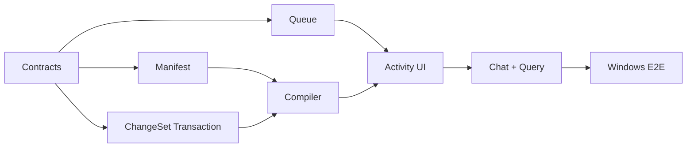

# Personal Knowledge OS Execution Plan / Windows 执行计划

Status: Active

Last updated: 2026-07-16

Target platform: Obsidian Desktop on Windows

本计划把 [`PERSONAL_KNOWLEDGE_OS_PRD.md`](./PERSONAL_KNOWLEDGE_OS_PRD.md) 的 Golden Flow 转换为可连续提交、逐步验收的工程路线。任务状态以 [`../TODO.md`](../TODO.md) 为准，架构契约以 [`PERSONAL_KNOWLEDGE_AGENT_SOLUTION.md`](./PERSONAL_KNOWLEDGE_AGENT_SOLUTION.md) 为准。

Current checkpoint: Commit A/B complete; Commit C is next. Slice 1A currently passes TypeScript `noEmit`, targeted ESLint, Prettier check, and 192 tests across seven Jest suites. No source code from the audited external candidates has been copied; attribution status is recorded in [`../THIRD_PARTY_NOTICES.md`](../THIRD_PARTY_NOTICES.md).

---

## 1. Outcome and Strategy

首个可用结果必须让一个真实来源完成完整复利闭环：

```text
Windows Explorer / Vault source
→ Add to Knowledge
→ durable queue
→ two-stage compile
→ multi-file ChangeSet review
→ recoverable write
→ grounded query + citation jump
→ unchanged source skip
```

执行策略：

1. 以 vertical slice 验收，不把 parser、queue、UI 分别做成永远无法使用的半成品。
2. 纯知识契约先行，Obsidian、Windows、模型和 UI 通过 adapter 接入。
3. 先保证来源、幂等、删除、引用和恢复语义，再增加自动化程度。
4. 复用当前 Search v3、ApplyView、Chat 文件拖入和进度 UI，不建立重复基础设施。
5. 外部代码先进入归属台账，再按 Copy / Port / Reference 实施。

## 2. Roadmap: Now / Next / Later

| Stage | Initiative                     | Desired outcome                          | Exit metric                             | Effort |
| ----- | ------------------------------ | ---------------------------------------- | --------------------------------------- | ------ |
| Now   | Slice 1A — Knowledge contracts | 所有后续模块共享稳定、可验证的数据语义   | 契约和 Windows fixtures 全部通过        | S      |
| Now   | Slice 1B — Queue and recovery  | 任务可见、可暂停、可恢复，不重复调用模型 | 重启/失败/重复来源状态测试通过          | M      |
| Now   | Slice 1C — Golden Flow         | 一个真实来源成为可引用、可复用的 Wiki    | 端到端 Windows fixture 和实机流程通过   | L      |
| Next  | Daily Knowledge Studio         | 用户每天可管理来源、审核、活动和健康状态 | 完成一周真实 Vault 使用且无人工修库     | L      |
| Next  | Retrieval and maintenance      | 新知识能稳定找回，陈旧和冲突可处理       | citation、reuse、lint 基准达到 PRD 门槛 | M      |
| Later | Graph exploration              | 图谱改善检索和知识缺口发现，而非只做展示 | 图增强任务集优于无图基线                | L      |
| Later | Temporal/Graphiti projection   | 历史状态和多跳关系确实需要外部投影       | 达到 PRD 中 Graphiti 接入门槛           | L      |

`Now` 是当前提交序列；`Next` 只有在 Golden Flow 被真实使用后才锁定细节；`Later` 是带门槛的探索，不是承诺。

## 3. NOW — Commit-by-commit Execution

### Commit A — Execution Baseline ✅

Scope:

- 固定本执行计划与 Windows-only 验收矩阵。
- 建立 `THIRD_PARTY_NOTICES.md` 与许可证存放规则。
- 建立 `src/knowledge/` 的依赖方向和公共导出边界。

Exit criteria:

- 外部来源、commit、许可证和本地目标可追踪。
- 尚未复制的项目明确标记为 audited/reference，不错误声明已包含其代码。
- 新模块不依赖 Settings singleton、Vault global、Provider Manager 或 React。

### Commit B — Contracts and Validation ✅

Target files:

```text
src/knowledge/
├── manifest/
│   ├── freshness.ts
│   └── freshness.test.ts
├── model/
│   ├── types.ts
│   ├── schemas.ts
│   ├── validation.ts
│   ├── fingerprint.ts
│   ├── schemas.test.ts
│   ├── validation.test.ts
│   └── fingerprint.test.ts
├── paths/
│   ├── vaultPath.ts
│   └── vaultPath.test.ts
└── index.ts
```

Scope:

- `KnowledgeBundleConfig`
- `SourceManifestEntry`
- `SourceLocator` / `ClaimCitation`
- `KnowledgeIngestJob`
- discriminated `KnowledgeFileChange`
- `KnowledgeChangeSet`
- Vault-relative path、locator、ChangeSet 和 Bundle deterministic validation
- exact source byte hash、binary/PDF hash 与 pipeline fingerprint

Exit criteria:

- create/update/delete 无歧义；update/delete 强制 before hash。
- Markdown line、heading、PDF page 和 quote locator 的必填字段由类型与 validator 共同保证。
- Pipeline fingerprint 对字段顺序稳定，对 schema/parser/compiler/model/output 变化敏感。
- 无 Obsidian、Node filesystem、模型或 UI import。

### Commit C — Source Manifest and Repository Port ← Next

Target files:

```text
src/knowledge/manifest/
├── SourceManifestRepository.ts
├── SourceManifestStorage.ts
└── *.test.ts
```

Scope:

- 版本化 manifest schema 与宽容读取。
- output existence、source hash、pipeline fingerprint 和 stale 判断。
- 通过 storage port 注入读写；Vault adapter 后置。
- 保留未知扩展字段，拒绝不兼容 major schema version。

Exit criteria:

- 相同 source + fingerprint + 完整输出返回 `up_to_date`。
- 输出缺失、fingerprint 变化或 source hash 变化返回明确 stale reason。
- 失败运行不覆盖 last successful state。

### Commit D — Persistent Queue Core

Target files:

```text
src/knowledge/ingest/queue/
├── IngestQueue.ts
├── QueueStorage.ts
├── RetryPolicy.ts
└── *.test.ts
```

Scope:

- pending/processing/paused/review/failed/completed/cancelled 状态机。
- 同一 source 去重；processing 时变化只安排一次 rerun。
- `AbortController`、指数退避、jitter、最大重试和 provider 限流暂停。
- 启动时 processing → pending，恢复 backlog 默认等待用户操作。

Exit criteria:

- 任一状态迁移均有测试；非法迁移 fail closed。
- 项目切换和重启不会丢 job 或重复执行。
- 取消不会删除已经存在或被多个来源共享的页面。

### Commit E — Recoverable ChangeSet Application

Target files:

```text
src/knowledge/changeset/
├── ChangeSetValidator.ts
├── ChangeSetTransaction.ts
├── TransactionStorage.ts
└── *.test.ts
```

Scope:

- 路径越界、重复目标、before-hash 冲突和 citation/link validation。
- pre-state journal、deterministic write order、commit marker 和 startup recovery。
- 明确 Obsidian Vault API 不提供真正跨文件原子性。

Exit criteria:

- 崩溃注入覆盖每个写入阶段。
- 恢复后不存在“任务/manifest 成功但页面未完成”。
- Raw Source target 永远被拒绝，除非未来出现独立显式动作契约。

### Commit F — Provider-neutral Compile Port

Target files:

```text
src/knowledge/compiler/
├── KnowledgeCompiler.ts
├── CompilerModelPort.ts
├── analysisSchema.ts
├── generationSchema.ts
└── *.test.ts
```

Scope:

- 阶段一输出概念、实体、主张、关系、引用和目标页面集合。
- 阶段二只能为阶段一批准的目标生成文件变更。
- 模型输出经过结构校验、路径校验和 citation normalization。
- Provider 和模型配置通过 port 注入；不复制外部 Provider Runtime。

Constraint:

- 本提交先实现接口、结构化 schema 和 deterministic orchestration。任何新增或修改 AI prompt 内容遵守仓库规则，只有在用户明确授权后单独提交。

Exit criteria:

- 模型不能通过输出新增未批准路径。
- 无效或不完整输出进入 review/failure，不直接写盘。
- 固定 fake model fixture 可以产生稳定 ChangeSet。

### Commit G — Multi-file Review and Activity UI

Scope:

- 扩展 ApplyView 支持多文件 create/update/delete。
- 复用 ProcessingStatus/IndexingProgressCard 视觉语言显示任务阶段。
- 增加 Knowledge Studio 最小 ItemView：Activity、ChangeSet Review、完成摘要。
- 遵守 popout-window 的 `.doc/.win` 和 `onWindowMigrated` 规则。

Exit criteria:

- 用户能逐文件、逐块或批量接受/拒绝；delete 有单独危险语义。
- UI 不展示任务成功，直到 commit marker 完成。
- Windows 触控板、键盘和不同窗口均可完成审核。

### Commit H — Chat Entry, Query, and Citation Jump

Scope:

- Chat 文件拖入增加 `Use in this chat` / `Add to Knowledge`。
- Wiki/index 渐进发现接入当前 Search v3。
- 回答使用 `ClaimCitation`，citation chip 能打开并定位 Markdown heading/line 或 PDF page。
- 增加 `Save to Wiki`，再次通过 ChangeSet review 写回。

Exit criteria:

- 一次使用的附件不会意外进入长期知识。
- 加入知识库的来源立即出现 job card。
- 模型没有实际读取的 artifact 不能成为 citation。

### Commit I — Windows End-to-end Validation

Scope:

- Markdown、中文文件名、CRLF、PDF、相同来源和已变化来源 fixture。
- 盘符/反斜杠、大小写碰撞、保留设备名、尾随点/空格、长路径和文件占用。
- 插件重启、模型失败、before-hash 冲突和事务恢复。
- 在独立 Windows Obsidian test Vault 完成实机验收。

Exit criteria:

- PRD First Vertical Slice 的 acceptance criteria 全部通过。
- `.env.test` 和 API key 不进入提交、日志、fixture 或错误消息。
- 记录首个 baseline：完成时间、模型调用数、citation navigation、accept/edit/reject。

## 4. Dependency Order



可以并行的只有：

- Manifest 与 Queue core；
- UI shell 与 fake compiler fixture；
- Windows fixture 准备与纯模型契约测试。

不能提前的工作：

- 没有 ChangeSet transaction 前，不接真实模型写盘。
- 没有 citation locator 前，不做“带来源回答”演示。
- 没有真实检索收益基线前，不建设完整 Sigma 图谱。
- 没有历史查询压力前，不部署 Graphiti。

## 5. Quality Gates

每个提交至少通过：

- 相关 Jest tests。
- TypeScript type check。
- Prettier format check。
- ESLint。
- `git diff --check`。
- 不包含密钥和无关用户文件。

Golden Flow 额外门槛：

- Raw Source 非授权写入为 0。
- Project/Bundle scope leakage 为 0。
- 无效 citation 为 0。
- 相同 source + fingerprint 的模型调用为 0。
- 恢复后错误 success marker 为 0。

## 6. Decision and Escalation Rules

- 小型纯逻辑模块可以直接 Copy，但 attribution、license 和 tests 必须同提交进入。
- 外部模块需要自己的 Runtime、数据库或状态系统时，默认 Port 契约，不整体嵌入。
- 新依赖必须回答：当前模块为何不能实现、bundle/启动/升级成本、Windows Runtime 兼容性和卸载恢复方式。
- 任何会修改 AI prompt、启用真实外部副作用、改变整个插件平台声明或引入常驻服务的步骤，单独提交并明确说明。
- 真实实现与本文冲突时，先更新决策和 TODO，再继续编码，不让文档长期失真。
